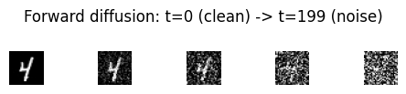

# Diffusion Models (DDPM)

Generate images by learning to *reverse* a gradual noising process: start from
pure Gaussian noise and denoise it, one small step at a time, into a sample.

:::note Prerequisites
This is the capstone of the generative track. You should have built an
[Autoencoder](/applications/generative/autoencoder) (the decoder/denoiser idea
carries over) and be comfortable with convolutional blocks from the
[ResNet architecture guide](/basics/vision/resnet-architecture). The training
loop follows the patterns in [Custom Training Loops](/research/custom-training-loops).
:::

:::tip What you'll learn
- The **forward process** that corrupts data with noise, and the closed form
  $q(x_t\mid x_0)$ that lets you jump to any timestep in one shot
- How to build a compact **time-conditioned U-Net** with `nnx.Embed` timestep
  embeddings and `nnx.GroupNorm` conv blocks
- The DDPM training objective — just an **MSE on predicted noise**
- **Ancestral sampling**: the reverse denoising loop with `jax.lax.fori_loop`
- Why diffusion is a **denoising autoencoder** in disguise, and how **DDIM**
  makes sampling dramatically faster
:::

:::info Example Code
See the full, runnable implementation:
[`examples/generative/ddpm.py`](https://github.com/mlnomadpy/flaxdocs/tree/master/examples/generative/ddpm.py)
:::

## The Motivation

Autoencoders and VAEs compress data to a latent and decode it back in a single
pass. Diffusion models take a different bet: instead of one hard generation
step, **break generation into many easy denoising steps**. Each step only has to
remove a little noise, which turns out to be a far more stable learning problem
and produces state-of-the-art image quality.

The recipe has two halves:

1. **Forward process** (fixed, no learning): gradually add Gaussian noise to a
   clean image until, after $T$ steps, it is indistinguishable from noise.
2. **Reverse process** (learned): train a network to undo one step of noising.
   Chain it $T$ times and you can walk pure noise back to a clean sample.

## The Forward Process

Define a small **variance schedule** $\beta_1,\dots,\beta_T$ (we use a linear
ramp from $10^{-4}$ to $0.02$). One noising step is

$$
q(x_t \mid x_{t-1}) = \mathcal{N}\!\left(x_t;\, \sqrt{1-\beta_t}\,x_{t-1},\, \beta_t \mathbf{I}\right).
$$

The magic of Gaussians is that we never have to iterate this. With
$\alpha_t = 1-\beta_t$ and the cumulative product
$\bar\alpha_t = \prod_{s=1}^{t}\alpha_s$, we can sample **any** timestep directly
from the clean image:

$$
q(x_t \mid x_0) = \mathcal{N}\!\left(x_t;\, \sqrt{\bar\alpha_t}\,x_0,\, (1-\bar\alpha_t)\mathbf{I}\right)
\quad\Longleftrightarrow\quad
x_t = \sqrt{\bar\alpha_t}\,x_0 + \sqrt{1-\bar\alpha_t}\,\epsilon,
\;\; \epsilon\sim\mathcal{N}(0,\mathbf{I}).
$$

That one-line reparameterization is the whole forward process in code:

```python
import jax, jax.numpy as jnp
from flax import nnx

class DiffusionSchedule:
    """Linear-beta schedule + closed-form forward process q(x_t | x_0).

    A plain Python container of precomputed constants (NOT an nnx.Module),
    so it never appears in the model's trainable state.
    """
    def __init__(self, T=200, beta_start=1e-4, beta_end=0.02):
        self.T = T
        betas = jnp.linspace(beta_start, beta_end, T)
        self.betas = betas
        self.alphas = 1.0 - betas
        self.alphas_cumprod = jnp.cumprod(self.alphas)        # \bar{alpha}_t
        self.sqrt_acp = jnp.sqrt(self.alphas_cumprod)
        self.sqrt_one_minus_acp = jnp.sqrt(1.0 - self.alphas_cumprod)

    def q_sample(self, x0, t, eps):
        a = self.sqrt_acp[t][:, None, None, None]
        b = self.sqrt_one_minus_acp[t][:, None, None, None]
        return a * x0 + b * eps
```

## The Training Objective

Ho et al. showed the variational bound simplifies to something startlingly
plain: instead of predicting the denoised image, train the network
$\epsilon_\theta$ to predict **the noise** that was added. The loss is a plain
mean-squared error:

$$
L = \mathbb{E}_{t,\,x_0,\,\epsilon}\left\|\epsilon - \epsilon_\theta(x_t, t)\right\|^2 .
$$

Read literally: sample a clean image $x_0$, a random timestep $t$, and noise
$\epsilon$; form $x_t$ with the closed form above; ask the network to guess
$\epsilon$ from $x_t$ and $t$. Nothing more.

### Connection to denoising autoencoders

If you fix $t$ to a single noise level, this objective *is* a
[denoising autoencoder](/applications/generative/autoencoder): corrupt the
input, reconstruct the clean signal. Diffusion generalizes that to a **whole
spectrum of noise levels** at once, sharing one network across all of them via
the timestep conditioning. That shared, multi-scale denoiser is what makes the
reverse chain possible.

## The Model: a Time-Conditioned U-Net

The network must know *how much* noise to remove, so every block receives the
timestep embedding. We embed $t$ with `nnx.Embed` (a learned lookup table), pass
it through a small MLP, and add it to the feature maps of each conv block.

Each block is `Conv → GroupNorm → (+ time embedding) → SiLU`. We wrap the block's
forward in `nnx.remat` (gradient checkpointing) to trade a little compute for
lower memory — useful once you scale up.

```python
class ConvBlock(nnx.Module):
    """Conv -> GroupNorm -> (+ time embedding) -> SiLU."""
    def __init__(self, in_ch, out_ch, time_dim, *, stride=1, num_groups=8, rngs):
        self.conv = nnx.Conv(in_ch, out_ch, kernel_size=(3, 3),
                             strides=(stride, stride), padding='SAME', rngs=rngs)
        self.norm = nnx.GroupNorm(out_ch, num_groups=num_groups, rngs=rngs)
        self.time_proj = nnx.Linear(time_dim, out_ch, rngs=rngs)

    @nnx.remat  # gradient checkpointing on the denoiser block
    def __call__(self, x, t_emb):
        h = self.conv(x)
        h = self.norm(h)
        h = h + self.time_proj(t_emb)[:, None, None, :]   # broadcast over H, W
        return nnx.silu(h)
```

The U-Net itself is deliberately tiny — one downsample, one upsample, one skip
connection (`~50k` params) so it trains in seconds on CPU. `nnx.ConvTranspose`
does the learned upsampling, exactly as in the autoencoder decoder.

```python
class DDPMUNet(nnx.Module):
    """Compact time-conditioned U-Net that predicts the noise eps."""
    def __init__(self, T=200, base=16, time_dim=64, *, rngs):
        # Learned timestep embedding: table lookup + small MLP.
        self.time_embed = nnx.Embed(T, time_dim, rngs=rngs)
        self.time_mlp1 = nnx.Linear(time_dim, time_dim, rngs=rngs)
        self.time_mlp2 = nnx.Linear(time_dim, time_dim, rngs=rngs)

        self.in_conv = nnx.Conv(1, base, kernel_size=(3, 3), padding='SAME', rngs=rngs)
        self.down = ConvBlock(base, base * 2, time_dim, stride=2, rngs=rngs)   # 28 -> 14
        self.mid = ConvBlock(base * 2, base * 2, time_dim, stride=1, rngs=rngs)
        self.up = nnx.ConvTranspose(base * 2, base, kernel_size=(3, 3),
                                    strides=(2, 2), padding='SAME', rngs=rngs)  # 14 -> 28
        self.out_block = ConvBlock(base * 2, base, time_dim, stride=1, rngs=rngs)
        self.out_conv = nnx.Conv(base, 1, kernel_size=(3, 3), padding='SAME', rngs=rngs)

    def __call__(self, x, t):
        te = self.time_embed(t)                # (B, time_dim)
        te = nnx.silu(self.time_mlp1(te))
        te = self.time_mlp2(te)

        h0 = nnx.silu(self.in_conv(x))         # (B,28,28,base)  -- skip source
        h1 = self.down(h0, te)                 # (B,14,14,base*2)
        h2 = self.mid(h1, te)                  # (B,14,14,base*2)
        u = nnx.silu(self.up(h2))              # (B,28,28,base)
        cat = jnp.concatenate([u, h0], axis=-1)  # skip connection
        h = self.out_block(cat, te)            # (B,28,28,base)
        return self.out_conv(h)                # (B,28,28,1) predicted noise
```

:::note GroupNorm over BatchNorm
Diffusion networks use `nnx.GroupNorm`, not `nnx.BatchNorm`. Batch statistics
are unreliable here — each example carries a *different, random* noise level, so
per-group normalization is far more stable. Keep channel counts divisible by
`num_groups` (here `8`).
:::

## The Training Step

We keep the schedule out of the jitted step: a helper samples a random timestep
and noise, forms $x_t$, and hands the step a ready-made batch. The step itself is
the textbook NNX pattern — `nnx.value_and_grad` with `has_aux`, then
`optimizer.update`.

```python
def sample_batch(schedule, x0, rng):
    key_t, key_e = jax.random.split(rng)
    t = jax.random.randint(key_t, (x0.shape[0],), 0, schedule.T)
    eps = jax.random.normal(key_e, x0.shape)
    x_t = schedule.q_sample(x0, t, eps)
    return {'x_t': x_t, 't': t, 'eps': eps}

@nnx.jit
def train_step(model, optimizer, batch):
    def loss_fn(model):
        pred = model(batch['x_t'], batch['t'])
        loss = jnp.mean((pred - batch['eps']) ** 2)   # MSE on the noise
        return loss, pred
    (loss, pred), grads = nnx.value_and_grad(loss_fn, has_aux=True)(model)
    optimizer.update(model, grads)
    return loss, pred
```

Build the model and optimizer with explicit RNGs and the modern `wrt=nnx.Param`
optimizer API:

```python
schedule = DiffusionSchedule(T=200)
model = DDPMUNet(T=200, rngs=nnx.Rngs(0))
optimizer = nnx.Optimizer(model, optax.adam(2e-3), wrt=nnx.Param)
```

## Sampling: the Reverse Process

Once $\epsilon_\theta$ is trained, generation runs the chain **backwards**.
Starting from $x_T\sim\mathcal{N}(0,\mathbf{I})$, each step removes a bit of
predicted noise:

$$
x_{t-1} = \frac{1}{\sqrt{\alpha_t}}\left(x_t - \frac{\beta_t}{\sqrt{1-\bar\alpha_t}}\,\epsilon_\theta(x_t, t)\right) + \sigma_t z,
\qquad z\sim\mathcal{N}(0,\mathbf{I}),
$$

with $\sigma_t=\sqrt{\beta_t}$ and no noise added on the final step ($t=0$).

We express the whole trajectory as one compiled `jax.lax.fori_loop`. Because the
denoiser uses a lifted `nnx.remat` transform, we `nnx.split` the model and thread
its (inference-only) state through the loop carry, re-merging inside the body —
the idiomatic way to call an NNX module from a raw `lax` loop:

```python
def generate(model, schedule, num_samples, rng):
    graphdef, state = nnx.split(model)
    T = schedule.T
    x = jax.random.normal(rng, (num_samples, 28, 28, 1))

    def body(i, carry):
        x, state, key = carry
        m = nnx.merge(graphdef, state)               # rebuild at loop trace level
        t = T - 1 - i                                # descend T-1 .. 0
        key, subkey = jax.random.split(key)
        t_batch = jnp.full((num_samples,), t, dtype=jnp.int32)

        eps_theta = m(x, t_batch)
        beta_t, alpha_t = schedule.betas[t], schedule.alphas[t]
        acp_t = schedule.alphas_cumprod[t]

        coef = beta_t / jnp.sqrt(1.0 - acp_t)
        mean = (x - coef * eps_theta) / jnp.sqrt(alpha_t)

        noise = jax.random.normal(subkey, x.shape)
        add_noise = (t > 0).astype(x.dtype)          # no noise on the last step
        x = mean + add_noise * jnp.sqrt(beta_t) * noise
        return (x, state, key)

    x, _, _ = jax.lax.fori_loop(0, T, body, (x, state, rng))
    return x
```

## Faster Sampling with DDIM

The DDPM sampler above needs *all* $T$ steps because it is a Markov chain.
**DDIM** (Song et al., 2021) reinterprets the same trained $\epsilon_\theta$
under a **non-Markovian**, deterministic process. First predict the clean image
from the current noisy one,

$$
\hat{x}_0 = \frac{x_t - \sqrt{1-\bar\alpha_t}\,\epsilon_\theta(x_t,t)}{\sqrt{\bar\alpha_t}},
$$

then jump directly to an *arbitrary* earlier timestep $s < t$:

$$
x_s = \sqrt{\bar\alpha_s}\,\hat{x}_0 + \sqrt{1-\bar\alpha_s}\,\epsilon_\theta(x_t, t).
$$

Because you can skip timesteps, DDIM produces comparable samples in **20–50
network evaluations instead of hundreds** — and, with the noise term dropped, it
is fully deterministic, giving a reproducible map from latent noise to image. No
retraining required: the same weights work for both samplers.

## Results / What to Expect

Running the verification harness (a 30-step CPU smoke test on synthetic
Gaussian-blob images) the noise-prediction MSE falls steadily as the denoiser
learns:

```text
params: 49,921
forward out shape: (8, 28, 28, 1)
loss[0]=1.4977  loss[-1]=0.1156
loss trace (every 5): [1.4977, 0.4235, 0.2436, 0.22, 0.164, 0.1269]
generated shape: (4, 28, 28, 1)

ALL ASSERTS PASSED
```

A random-noise baseline scores a loss of $\approx 1.0$ (predicting zeros).
Dropping well below that means the network is genuinely recovering the injected
noise. The full script (`python generative/ddpm.py`) trains a few epochs and
then draws four samples from pure noise:

```text
  epoch  1/3 | noise-MSE: 0.7321
  epoch  2/3 | noise-MSE: 0.2676
  epoch  3/3 | noise-MSE: 0.1856

  generated samples: (4, 28, 28, 1) range=[-2.13, 2.78]
```

The **forward process** — the part the whole method is built on — is exact and
deterministic. Here is one MNIST digit corrupted step by step until it is
indistinguishable from noise, which is precisely what the network learns to
reverse:



*Left to right: `t = 0` (clean) → `t = T-1` (isotropic Gaussian noise), via the
closed-form `q(x_t | x_0)`. Training teaches the U-Net to undo one such step at a
time.*

On real MNIST (`SYNTHETIC=0`) with more epochs the reverse-process samples sharpen
into recognizable digits; on CPU, keep `T` and the dataset small.

## Common Pitfalls

**Predicting the image instead of the noise**
❌ Regressing $x_0$ directly is harder to optimize and trains slowly.
✅ Predict $\epsilon$ (the $\epsilon$-parameterization) and use the plain MSE loss.

**Wrong noise-injection formula**
❌ `x_t = x0 + t * eps` or forgetting the `sqrt`.
✅ `x_t = sqrt(acp)*x0 + sqrt(1-acp)*eps` with `acp = alphas_cumprod[t]`.

**BatchNorm inside the denoiser**
❌ `nnx.BatchNorm` mixes examples that sit at wildly different noise levels.
✅ Use `nnx.GroupNorm` (channels divisible by `num_groups`).

**Forgetting the timestep conditioning**
❌ A network that ignores $t$ cannot know how much noise to remove.
✅ Embed $t$ with `nnx.Embed` and add its projection into every block.

**Adding noise on the final reverse step**
❌ Injecting $\sigma_t z$ at $t=0$ leaves visible speckle on the output.
✅ Gate the noise term with `(t > 0)` so the last step is deterministic.

## Next steps

- [Variational Autoencoders (VAE)](/applications/generative/vae) — the other
  principled latent-variable generator; contrast its single-step ELBO with
  diffusion's many-step objective.
- [Generative Adversarial Networks (GAN)](/applications/generative/gan) — learn
  the data density *implicitly* through an adversarial game.

## Complete Example

- [`examples/generative/ddpm.py`](https://github.com/mlnomadpy/flaxdocs/tree/master/examples/generative/ddpm.py)
  — a complete, CPU-verifiable DDPM: linear noise schedule, time-conditioned
  U-Net denoiser, MSE training step, and `fori_loop` ancestral sampling.

## References

- **DDPM**: [Denoising Diffusion Probabilistic Models](https://arxiv.org/abs/2006.11239) (Ho, Jain & Abbeel, 2020)
- **DDIM**: [Denoising Diffusion Implicit Models](https://arxiv.org/abs/2010.02502) (Song, Meng & Ermon, 2021)
- **Score-based view**: [Score-Based Generative Modeling through SDEs](https://arxiv.org/abs/2011.13456) (Song et al., 2021)
- **Improved DDPM**: [Improved Denoising Diffusion Probabilistic Models](https://arxiv.org/abs/2102.09672) (Nichol & Dhariwal, 2021)
- **Original diffusion**: [Deep Unsupervised Learning using Nonequilibrium Thermodynamics](https://arxiv.org/abs/1503.03585) (Sohl-Dickstein et al., 2015)
