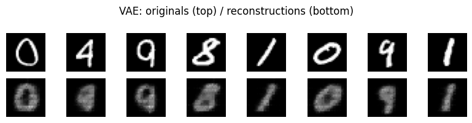

# Variational Autoencoder (VAE)

Turn an autoencoder's bottleneck into a *probability distribution* you can sample from, and generate brand-new digits.

:::note Prerequisites
- [Autoencoders](/applications/generative/autoencoder) — the encoder/decoder and `nnx.ConvTranspose` upsampling this guide reuses.
- [Understanding State & RNGs](/basics/fundamentals/understanding-state) — why NNX makes randomness explicit.
:::

:::tip What you'll learn
- Why a plain autoencoder's latent space can't be sampled, and how a VAE fixes it.
- The **ELBO** objective: a reconstruction term plus a KL regularizer, in closed form.
- The **reparameterization trick** that lets gradients flow through a random sample.
- How Flax NNX's **explicit RNG streams** (`params` vs. `noise`) cleanly separate weight init from latent sampling.
- Reusing shared `ConvEncoder` / `ConvDecoder` bodies for the encoder and decoder.
:::

:::info Example Code
The complete, runnable script for this guide lives at
[`examples/generative/vae.py`](https://github.com/mlnomadpy/flaxdocs/tree/master/examples/generative/vae.py).
:::

## From autoencoder to VAE

A [plain autoencoder](/applications/generative/autoencoder) maps each image to a
single point in latent space. That's great for reconstruction, but the latent
space is full of *holes*: pick a random point and the decoder produces garbage,
because nothing forced nearby points to be meaningful.

A **variational autoencoder** fixes this by making the encoder output a
*distribution* instead of a point — a Gaussian $q(z \mid x) = \mathcal{N}(\mu,
\operatorname{diag}(\sigma^2))$ — and by pulling every one of those Gaussians
toward a shared prior $p(z) = \mathcal{N}(0, I)$. Once training packs the latent
space against that prior, you can sample $z \sim \mathcal{N}(0, I)$ and decode it
into a realistic new digit.

## The math: the ELBO

We want to maximize the likelihood $p(x)$, but the marginal is intractable.
Instead we maximize a tractable lower bound, the **evidence lower bound (ELBO)**:

$$
\mathcal{L} = \mathbb{E}_{q(z|x)}\big[\log p(x|z)\big] - D_{KL}\big(q(z|x)\,\|\,p(z)\big)
$$

Two forces balance here:

- The **reconstruction term** $\mathbb{E}_{q(z|x)}[\log p(x|z)]$ wants the decoder
  to rebuild $x$ from its latent code. For binary/greyscale pixels we model
  $p(x|z)$ as independent Bernoullis, so $-\log p(x|z)$ is the sigmoid
  **binary cross-entropy** between the decoder logits and the input.
- The **KL term** $D_{KL}(q(z|x)\|p(z))$ pulls each encoded Gaussian toward the
  prior. For two Gaussians it has a closed form (no sampling needed):

$$
D_{KL}\big(\mathcal{N}(\mu, \sigma^2)\,\|\,\mathcal{N}(0, I)\big)
= -\tfrac{1}{2} \sum_{j} \Big(1 + \log \sigma_j^2 - \mu_j^2 - \sigma_j^2\Big)
$$

We **minimize** the negative ELBO: `loss = recon + kl`.

### The reparameterization trick

To train with gradient descent we need to backprop *through* the sampling step
$z \sim q(z|x)$ — but sampling is not differentiable. The trick is to move the
randomness outside the parameters:

$$
z = \mu + \sigma \odot \epsilon, \qquad \epsilon \sim \mathcal{N}(0, I)
$$

Now $\mu$ and $\sigma$ are deterministic functions of the weights, $\epsilon$ is
an external noise source, and gradients flow cleanly into the encoder. In
practice we predict $\log \sigma^2$ (`logvar`) for numerical stability and
recover $\sigma = \exp(\tfrac{1}{2}\log \sigma^2)$.

## Why NNX explicit RNG streams matter

The VAE needs randomness in **two unrelated places**: initializing weights, and
drawing $\epsilon$ every forward pass. If they shared one stream, changing the
model size would shift your sampling noise, and vice versa — a debugging
nightmare. Flax NNX makes each stream a named, independent generator:

```python
rngs = nnx.Rngs(params=0, noise=1)   # weight init vs. latent sampling
```

Layers pull their init keys from the `params` stream, while our `__call__` pulls
fresh noise from `self.rngs.noise()`. The RNG state lives *inside* the model, so
it is tracked correctly under `nnx.jit` and advances on every call.

## Building the model

### Encoder: two heads for μ and log σ²

The encoder reuses the shared `ConvEncoder` body — two stride-2 conv blocks that
take a `(B, 28, 28, 1)` image down to `(B, 7, 7, 32)` — then flattens and splits
into a `mu` head and a `logvar` head.

```python
from flax import nnx
from shared.models import ConvEncoder, ConvDecoder

class Encoder(nnx.Module):
    def __init__(self, latent_dim: int, base: int = 16, *, rngs: nnx.Rngs):
        self.body = ConvEncoder(1, base, rngs=rngs)   # (B,28,28,1) -> (B,7,7,base*2)
        feat = base * 2 * 7 * 7                        # 32 * 7 * 7 = 1568
        self.mu = nnx.Linear(feat, latent_dim, rngs=rngs)
        self.logvar = nnx.Linear(feat, latent_dim, rngs=rngs)

    def __call__(self, x):
        h = self.body(x)
        h = h.reshape(h.shape[0], -1)                  # flatten
        return self.mu(h), self.logvar(h)
```

### VAE: reparameterize and decode

The decoder is the shared `ConvDecoder`, which upsamples a latent vector back to
`(B, 28, 28, 1)` **logits**. The `VAE` module ties encoder, sampling, and
decoder together, and keeps a `sample()` helper for pure generation.

```python
import jax
import jax.numpy as jnp

class VAE(nnx.Module):
    def __init__(self, latent_dim: int = 16, base: int = 16, *, rngs: nnx.Rngs):
        self.latent_dim = latent_dim
        self.encoder = Encoder(latent_dim, base, rngs=rngs)
        self.decoder = ConvDecoder(latent_dim, base, 1, rngs=rngs)  # -> logits
        self.rngs = rngs

    def __call__(self, x):
        mu, logvar = self.encoder(x)
        std = jnp.exp(0.5 * logvar)
        eps = jax.random.normal(self.rngs.noise(), mu.shape)  # external noise
        z = mu + std * eps                                    # reparameterization
        return self.decoder(z), mu, logvar

    def sample(self, n: int, seed: int = 0):
        z = jax.random.normal(jax.random.key(seed), (n, self.latent_dim))
        return nnx.sigmoid(self.decoder(z))                   # logits -> [0, 1]
```

Note the decoder returns **logits** in `__call__` (so the loss can use numerically
stable sigmoid-BCE) but `sample()` applies `nnx.sigmoid` to produce viewable
pixels in $[0, 1]$.

## The loss and train step

The loss returns the negative ELBO plus its two components as auxiliary data. We
reuse the shared `bce_loss` (summed sigmoid BCE per image) and `kl_divergence`
(the closed-form Gaussian KL above).

```python
from shared.training_utils import bce_loss, kl_divergence

def vae_loss(model, x):
    logits, mu, logvar = model(x)
    recon = bce_loss(logits, x)        # -E_q[log p(x|z)]
    kl = kl_divergence(mu, logvar)     # D_KL(q(z|x) || N(0, I))
    return recon + kl, (recon, kl)
```

The train step follows the standard NNX pattern — `nnx.value_and_grad` with
`has_aux=True`, then `optimizer.update(model, grads)`:

```python
@nnx.jit
def train_step(model, optimizer, batch):
    def loss_fn(model):
        return vae_loss(model, batch)

    (loss, (recon, kl)), grads = nnx.value_and_grad(loss_fn, has_aux=True)(model)
    optimizer.update(model, grads)
    return loss, (recon, kl)
```

Wire it together with two RNG streams and Adam:

```python
import optax

rngs = nnx.Rngs(params=0, noise=1)
model = VAE(latent_dim=16, rngs=rngs)
optimizer = nnx.Optimizer(model, optax.adam(1e-3), wrt=nnx.Param)
```

## Results / What to expect

The script defaults to tiny **synthetic** data (smooth Gaussian blobs, no
downloads) so it runs offline on CPU in seconds. You should see the negative
ELBO fall steadily as reconstruction improves while the KL term settles:

```console
$ python generative/vae.py
epoch 1/3  ELBO loss 545.47  (recon 531.13  kl 0.51)
epoch 2/3  ELBO loss 511.34  (recon 492.09  kl 1.00)
epoch 3/3  ELBO loss 450.06  (recon 392.50  kl 20.26)
generated samples: (8, 28, 28, 1)
```

Early on the KL term sits near zero (the encoder collapses to the prior while it
learns to reconstruct); as training continues the latent code starts carrying
information and the KL grows — exactly the reconstruction-vs-regularization
balance the ELBO trades off.

On **real MNIST** (`SYNTHETIC=0`, 80 epochs), decoding the posterior mean back to
pixels recovers the input through the probabilistic latent:



*Top: real inputs. Bottom: each digit encoded to `(mu, logvar)`, then decoded
from `mu`. The reconstructions are soft — a VAE trades sharpness for a smooth,
samplable latent space — but clearly the same digits.*

:::tip Avoiding posterior collapse
If reconstructions come out as identical grey blobs, the KL term has overpowered
reconstruction and the decoder is ignoring the latent (**posterior collapse**).
The fix is a **β-VAE**: down-weight the KL with `loss = recon + β·kl` for `β < 1`
(this script exposes a `BETA` env knob; the image above used `BETA=0.15`).
:::

Set `SYNTHETIC=0` to train on real MNIST via `tfds`, and tune `EPOCHS` / `BATCH` /
`BETA` via environment variables. As training continues the KL term grows as the
latent space organizes toward the prior — after which `model.sample(n, seed)`
yields novel digits sampled from that latent.

## Common Pitfalls

- ❌ Predicting $\sigma$ directly and taking its log (can go negative → `NaN`).
  ✅ Predict `logvar` and use `std = jnp.exp(0.5 * logvar)`; the exp keeps $\sigma > 0$.

- ❌ Sampling with `z = jax.random.normal(...)` *inside* `loss_fn` from a key you
  reuse every step (frozen or duplicated noise).
  ✅ Pull fresh noise from an NNX stream, `self.rngs.noise()`, so each call advances
  the RNG state and `nnx.jit` tracks it.

- ❌ Applying `sigmoid` before the loss and then using BCE (double sigmoid, unstable).
  ✅ Keep the decoder's `__call__` output as **logits** and feed them to sigmoid-BCE;
  only apply `nnx.sigmoid` when you want images to look at.

- ❌ Dropping the KL term (or averaging BCE over pixels while summing KL). The two
  terms end up on wildly different scales and the model ignores the prior.
  ✅ Sum BCE over pixels and sum KL over latent dims, then average both over the
  batch — as the shared `bce_loss` and `kl_divergence` do.

- ❌ Sharing one RNG stream for weights and sampling (`nnx.Rngs(0)`), so resizing
  the model silently changes your noise.
  ✅ Use named streams: `nnx.Rngs(params=0, noise=1)`.

## Next steps

- [Generative Adversarial Networks (GAN)](/applications/generative/gan) — learn the
  data density *implicitly* with an adversarial game instead of an explicit ELBO.
- [Diffusion Models (DDPM)](/applications/generative/diffusion) — generate by
  iteratively denoising, trading one latent draw for many refinement steps.

## Complete Example

The full, verified script is at
[`examples/generative/vae.py`](https://github.com/mlnomadpy/flaxdocs/tree/master/examples/generative/vae.py)
— a CPU-friendly VAE with synthetic-data defaults, ELBO training loop, and a
`sample()` generator.

## References

- Kingma & Welling, *Auto-Encoding Variational Bayes* (2013). [arXiv:1312.6114](https://arxiv.org/abs/1312.6114)
- Rezende, Mohamed & Wierstra, *Stochastic Backpropagation and Approximate Inference in Deep Generative Models* (2014). [arXiv:1401.4082](https://arxiv.org/abs/1401.4082)
- Doersch, *Tutorial on Variational Autoencoders* (2016). [arXiv:1606.05908](https://arxiv.org/abs/1606.05908)
- Higgins et al., *β-VAE: Learning Basic Visual Concepts with a Constrained Variational Framework* (2017). [OpenReview](https://openreview.net/forum?id=Sy2fzU9gl)
