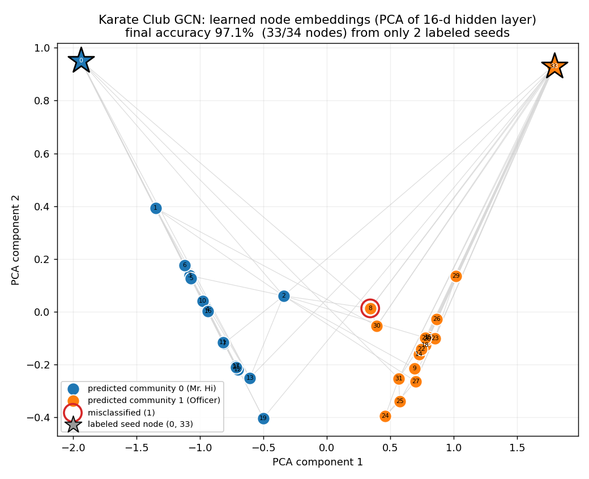

# Graph Neural Networks with GCN

Classify every member of a social network into their faction — from just **two**
labeled examples — by letting each node learn from its neighbors.

:::note Prerequisites
You should be comfortable building modules in [Your First Model](/basics/fundamentals/your-first-model)
and running a [Simple Training Loop](/basics/workflows/simple-training). No prior
graph-theory background is required — we build the graph from scratch.
:::

:::tip What you'll learn
- How **message passing** turns a graph into a differentiable layer
- Build the symmetric-normalized adjacency $\hat A = \tilde D^{-1/2}(A+I)\tilde D^{-1/2}$
- Implement a `GCNLayer` with `nnx.Linear` for the weight and an `einsum` for neighborhood aggregation
- Train **semi-supervised**: cross-entropy on 2 labeled nodes, evaluated on all 34
- Recover the real community split at ~97% accuracy in under 100 steps
:::

:::info Example Code
See the full implementation: [`examples/scientific/gcn_karate.py`](https://github.com/mlnomadpy/flaxdocs/tree/master/examples/scientific/gcn_karate.py)
:::

## Why graphs?

Images live on grids and text lives in sequences, but a huge amount of the
world is **relational**: social networks, molecules, citation graphs, road
maps. These have no fixed size and no natural ordering — a convolution or an
RNN has nothing to slide along.

A **Graph Neural Network (GNN)** operates directly on the connectivity. The core
idea is **message passing**: every node repeatedly updates its representation by
aggregating the representations of its neighbors. After $L$ rounds, a node's
embedding summarizes its $L$-hop neighborhood, and nearby nodes end up with
similar embeddings — exactly the signal we need to separate communities.

We'll use **Zachary's Karate Club**: 34 members, 78 friendship edges, and a
famous real-world split into two factions after a dispute between the instructor
(node 0) and the administrator (node 33). We reveal only those two leaders'
labels and ask the GCN to classify everyone else.

## The math: neighborhood aggregation

A single graph-convolution layer transforms node features $H^{(l)} \in
\mathbb{R}^{N \times d_l}$ into $H^{(l+1)}$ with the propagation rule from
Kipf & Welling:

$$
H^{(l+1)} = \sigma\!\left( \hat A \, H^{(l)} \, W^{(l)} \right)
$$

Reading it right-to-left:

- $H^{(l)} W^{(l)}$ — a learnable linear transform of every node's features (the weight $W^{(l)}$).
- $\hat A \,(\cdot)$ — **aggregation**: each node's new vector is a weighted sum over its neighbors' transformed vectors.
- $\sigma$ — a nonlinearity (ReLU).

The aggregation matrix $\hat A$ is the **symmetric-normalized adjacency with
self-loops**:

$$
\hat A = \tilde D^{-1/2}\,(A + I)\,\tilde D^{-1/2},
\qquad
\tilde D_{ii} = \sum_j (A + I)_{ij}
$$

Two design choices matter here:

- **Self-loops** ($A + I$) let a node keep its own features, not just its neighbors'.
- **Symmetric normalization** ($\tilde D^{-1/2}\cdots\tilde D^{-1/2}$) stops high-degree hubs from dominating and keeps activations well-scaled across layers.

For node $i$, one layer computes, elementwise:

$$
h_i^{(l+1)} = \sigma\!\Big( \sum_{j \in \mathcal{N}(i)\cup\{i\}} \frac{1}{\sqrt{\tilde d_i \tilde d_j}}\, W^{(l)\top} h_j^{(l)} \Big)
$$

## Building the graph

We hardcode the standard 78 undirected edges, build the binary adjacency, add
self-loops, and symmetric-normalize. This is a pure NumPy/JAX preprocessing step
— no parameters:

```python
import jax.numpy as jnp

NUM_NODES = 34

def normalize_adjacency(edges, num_nodes: int):
    a = jnp.zeros((num_nodes, num_nodes), dtype=jnp.float32)
    src = jnp.array([e[0] for e in edges])
    dst = jnp.array([e[1] for e in edges])
    a = a.at[src, dst].set(1.0)
    a = a.at[dst, src].set(1.0)          # undirected -> symmetric

    a = a + jnp.eye(num_nodes)           # self-loops (A + I)
    deg = a.sum(axis=1)                  # degrees of (A + I)
    d_inv_sqrt = jnp.diag(jnp.power(deg, -0.5))
    return d_inv_sqrt @ a @ d_inv_sqrt   # D^{-1/2} (A + I) D^{-1/2}
```

For **features** we use the identity matrix — every node is a one-hot vector of
its own id. The GCN has no other information to go on: it must infer everything
from the graph structure. (You could instead learn a dense feature per node with
`nnx.Embed(34, feat)`; both work here.)

## The GCN layer

Each layer is one line of linear algebra: apply the weight $W$ with `nnx.Linear`
(no bias), then aggregate over neighbors with a parameter-free `einsum` against
the fixed $\hat A$.

```python
import jax
import jax.numpy as jnp
from flax import nnx

class GCNLayer(nnx.Module):
    """One graph convolution:  H' = A_hat @ (H @ W)."""

    def __init__(self, in_features: int, out_features: int, *, rngs: nnx.Rngs):
        self.linear = nnx.Linear(in_features, out_features, use_bias=False, rngs=rngs)

    def __call__(self, a_hat: jax.Array, h: jax.Array) -> jax.Array:
        h = self.linear(h)                          # H W          -> (N, out)
        h = jnp.einsum("ij,jf->if", a_hat, h)       # A_hat (H W)  -> (N, out)
        return h
```

Stacking two layers turns 34-dim one-hot inputs into 2-dim class logits. The
first layer mixes 1-hop neighborhoods; the second reaches 2 hops:

```python
NUM_CLASSES = 2

class GCN(nnx.Module):
    def __init__(self, in_features, hidden_features, num_classes, *, rngs: nnx.Rngs):
        self.gcn1 = GCNLayer(in_features, hidden_features, rngs=rngs)
        self.gcn2 = GCNLayer(hidden_features, num_classes, rngs=rngs)

    def __call__(self, a_hat, features):
        h = nnx.relu(self.gcn1(a_hat, features))    # (N, hidden)
        logits = self.gcn2(a_hat, h)                # (N, num_classes)
        return logits

model = GCN(NUM_NODES, 16, NUM_CLASSES, rngs=nnx.Rngs(0))
```

## Semi-supervised training

Here's the twist that makes GNNs shine: we only have labels for the **two faction
leaders** (node 0 = Mr. Hi, node 33 = Officer). A boolean `train_mask` picks them
out, and the loss is cross-entropy averaged over the masked nodes only:

```python
import optax

def masked_cross_entropy(logits, labels, mask):
    ce = optax.softmax_cross_entropy_with_integer_labels(logits, labels)
    return (ce * mask).sum() / mask.sum()   # average over labeled nodes only
```

The train step is the standard NNX pattern — a full-batch pass over the whole
graph each step, with `nnx.value_and_grad` and `optimizer.update`:

```python
@nnx.jit
def train_step(model, optimizer, batch):
    def loss_fn(model):
        logits = model(batch["a_hat"], batch["features"])
        loss = masked_cross_entropy(logits, batch["labels"], batch["train_mask"])
        acc = jnp.mean(logits.argmax(-1) == batch["labels"])   # over ALL nodes
        return loss, acc

    (loss, acc), grads = nnx.value_and_grad(loss_fn, has_aux=True)(model)
    optimizer.update(model, grads)
    return loss, acc

optimizer = nnx.Optimizer(model, optax.adam(1e-2), wrt=nnx.Param)
for step in range(200):
    loss, acc = train_step(model, optimizer, batch)
```

Even though gradients only flow from two labels, `A_hat` propagates that signal
across every edge: the labels of nodes 0 and 33 diffuse through the graph, and
the two leaders' anchors pin the orientation so class 0 stays "Mr. Hi" and class
1 stays "Officer" (no label-flipping ambiguity).

## Results / What to expect

Training for 200 full-batch steps on CPU takes only a few seconds. The masked
loss collapses toward zero and full-graph accuracy climbs to **97%** — the GCN
recovers the true faction split, misclassifying just one boundary node:

```console
$ python scientific/gcn_karate.py
Training GCN on Zachary's Karate Club for 200 steps (labeled anchors: nodes 0 and 33)

step    0 | masked loss 0.6883 | full-graph acc 0.529
step   20 | masked loss 0.3331 | full-graph acc 0.941
step   40 | masked loss 0.0491 | full-graph acc 0.941
step   60 | masked loss 0.0094 | full-graph acc 0.971
step  100 | masked loss 0.0025 | full-graph acc 0.971
step  199 | masked loss 0.0007 | full-graph acc 0.971

Final full-graph accuracy: 0.971 (33/34 nodes)
```



*The trained GCN's hidden-layer embeddings, projected to 2D with PCA and colored by predicted community. The two factions form cleanly separated clusters anchored by the two labeled seed nodes (stars at opposite corners) — visual proof that message passing diffused just two labels across all 78 edges to recover the real split, with only boundary node 8 (red ring) misassigned.*

Starting from ~53% (random guessing on a balanced 2-class problem), the model
crosses 90% within 20 steps and stabilizes at 33/34 correct. The single
persistent error is a node on the boundary between the two communities — exactly
where even humans disagreed in the original study.

## Common pitfalls

**Forgetting self-loops.**

❌ Normalizing $A$ alone drops each node's own features during aggregation.
```python
a_hat = normalize(a)          # neighbors only — node forgets itself
```
✅ Add the identity first so a node keeps its own signal.
```python
a_hat = normalize(a + jnp.eye(num_nodes))
```

**Row-normalizing instead of symmetric-normalizing.**

❌ $D^{-1}A$ (a random-walk average) lets hub nodes wash out weak neighbors and
can destabilize deep stacks.
```python
a_hat = jnp.diag(1.0 / deg) @ a
```
✅ Use the symmetric form $\tilde D^{-1/2}(A+I)\tilde D^{-1/2}$.
```python
d = jnp.diag(jnp.power(deg, -0.5))
a_hat = d @ (a + jnp.eye(n)) @ d
```

**Computing the loss over every node.**

❌ In a semi-supervised setting you don't have all the labels — averaging over
all 34 leaks the answer and defeats the point.
```python
loss = softmax_cross_entropy(logits, labels).mean()   # uses all labels!
```
✅ Mask the loss to the few labeled nodes.
```python
loss = (ce * train_mask).sum() / train_mask.sum()
```

**Putting a bias in the graph-conv weight.**

❌ A bias term is redundant with the aggregation and muddies the message-passing math.
```python
self.linear = nnx.Linear(d_in, d_out, rngs=rngs)        # use_bias=True
```
✅ Disable it; $\hat A$ already provides the affine mixing.
```python
self.linear = nnx.Linear(d_in, d_out, use_bias=False, rngs=rngs)
```

**Passing plain Python lists of submodules to NNX.**

❌ A bare list of layers won't register as state and crashes on Flax 0.12.
```python
self.layers = [GCNLayer(...), GCNLayer(...)]
```
✅ Wrap submodule collections in `nnx.List`.
```python
self.layers = nnx.List([GCNLayer(...), GCNLayer(...)])
```

## Next steps

- [Physics-Informed Neural Networks (PINN)](/applications/scientific/pinn) — another
  scientific-ML pattern where JAX autodiff, not a dataset, does the heavy lifting.
- [Custom Training Loops](/research/custom-training-loops) — deepen the training
  patterns used here.

## Complete Example

[`examples/scientific/gcn_karate.py`](https://github.com/mlnomadpy/flaxdocs/tree/master/examples/scientific/gcn_karate.py)
— the full, runnable GCN with hardcoded graph, symmetric normalization, and the
semi-supervised training loop.

## References

- Kipf & Welling (2017), *Semi-Supervised Classification with Graph Convolutional Networks* — [arXiv:1609.02907](https://arxiv.org/abs/1609.02907)
- Hamilton, Ying & Leskovec (2017), *Inductive Representation Learning on Large Graphs (GraphSAGE)* — [arXiv:1706.02216](https://arxiv.org/abs/1706.02216)
- Veličković et al. (2018), *Graph Attention Networks* — [arXiv:1710.10903](https://arxiv.org/abs/1710.10903)
- Gilmer et al. (2017), *Neural Message Passing for Quantum Chemistry* — [arXiv:1704.01212](https://arxiv.org/abs/1704.01212)
