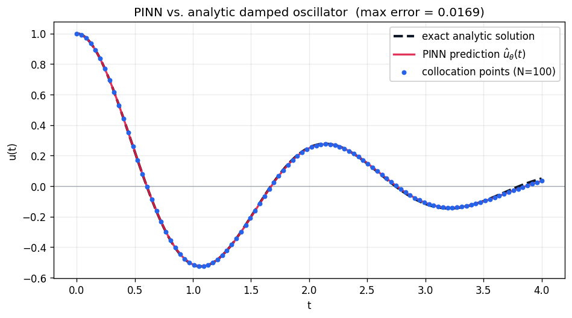

# Physics-Informed Neural Networks (PINNs)

**Solve a differential equation with a neural network — and not a single training label in sight.** The equation *is* the supervision.

:::note Prerequisites
You should be comfortable building a model ([your first model](/basics/fundamentals/your-first-model)) and writing your own loop ([custom training loops](/research/custom-training-loops), [training best practices](/basics/training-best-practices)). A little calculus (derivatives, second-order ODEs) helps.
:::

:::tip What you'll learn
- How a PINN turns a differential equation into a **loss function** with no dataset
- How to differentiate the network's **output with respect to its input** using `jax.grad` — twice
- Why `jax.grad(jax.grad(...))` plus `vmap` is the perfect tool for this
- Why smooth activations (**tanh**, not ReLU) are non-negotiable for second-order physics
- How to enforce **initial conditions** so the network learns the *right* solution
:::

:::info Example Code
See the full implementation: [`examples/scientific/pinn_oscillator.py`](https://github.com/mlnomadpy/flaxdocs/tree/master/examples/scientific/pinn_oscillator.py)
:::

## This guide is different

Every other guide on this site fits a model to **data**: you have inputs `x`, targets `y`, and a loss that measures the gap. Here there is no `y`. Instead you have a **law of physics** the solution must obey, and you turn *that* into the loss.

The trick is that a neural network $\hat u_\theta(t)$ is a smooth, differentiable function of its input. So we can ask JAX for its derivatives **with respect to the input** $t$ and check whether they satisfy the governing equation. This is the one guide where you differentiate the *model itself*, not a loss over samples.

## The problem: a damped harmonic oscillator

A mass on a spring with friction obeys a second-order linear ODE:

$$
u''(t) + 2\zeta\omega\, u'(t) + \omega^2 u(t) = 0, \qquad u(0) = 1,\ \ u'(0) = 0,
$$

on $t \in [0, T]$, where $\omega$ is the natural frequency and $\zeta$ the damping ratio. For the underdamped case ($0 < \zeta < 1$) the exact solution is a decaying cosine, which we only use to *check* our network afterward:

$$
u(t) = e^{-\zeta\omega t}\left(\cos(\omega_d t) + \frac{\zeta\omega}{\omega_d}\sin(\omega_d t)\right),
\qquad \omega_d = \omega\sqrt{1 - \zeta^2}.
$$

## From equation to loss

Let $\hat u_\theta(t)$ be our network. Define the **residual** — how badly the network violates the ODE at a point $t$:

$$
r_\theta(t) = \hat u_\theta''(t) + 2\zeta\omega\, \hat u_\theta'(t) + \omega^2 \hat u_\theta(t).
$$

If $\hat u_\theta$ were the true solution, $r_\theta(t) = 0$ everywhere. So we sample a set of **collocation points** $\{t_i\}_{i=1}^N$ on $[0, T]$ (just a `linspace` — no dataset) and minimize the mean-squared residual, plus a penalty pinning down the initial conditions:

$$
\mathcal{L}(\theta) = \underbrace{\frac{1}{N}\sum_{i=1}^N r_\theta(t_i)^2}_{\text{physics}}
\;+\; \lambda\,\underbrace{\big[(\hat u_\theta(0) - 1)^2 + \hat u_\theta'(0)^2\big]}_{\text{initial conditions}}.
$$

**The initial-condition term is not optional.** The trivial function $u \equiv 0$ also satisfies the ODE — the IC penalty is what forces the network onto the *one* solution we want.

The derivatives $\hat u_\theta'$ and $\hat u_\theta''$ are computed **exactly** by automatic differentiation, not finite differences. `jax.grad` gives $\hat u_\theta'$, and `jax.grad` again gives $\hat u_\theta''$. This is why JAX is ideal for PINNs: you can differentiate through the network with respect to its input, arbitrarily many times, and compose that with `vmap` (evaluate at all collocation points) and `jit` (compile the whole thing).

## The model

A small MLP mapping a scalar $t$ to a scalar $u$. The activation matters: **tanh** is smooth, so its first and second derivatives are well-behaved — a ReLU network has a zero second derivative almost everywhere, which would make the physics loss meaningless.

```python
import jax
import jax.numpy as jnp
from flax import nnx
import optax

OMEGA = 3.0    # natural frequency
ZETA = 0.2     # damping ratio (0 < zeta < 1)
T = 4.0        # domain [0, T]
W_IC = 10.0    # weight on the initial-condition term


class PINN(nnx.Module):
    """Scalar-in, scalar-out MLP approximating u(t)."""

    def __init__(self, hidden: int = 32, n_layers: int = 4, *, rngs: nnx.Rngs):
        layers = [nnx.Linear(1, hidden, rngs=rngs)]
        for _ in range(n_layers - 1):
            layers.append(nnx.Linear(hidden, hidden, rngs=rngs))
        self.layers = nnx.List(layers)          # nnx.List, not a plain list!
        self.out = nnx.Linear(hidden, 1, rngs=rngs)

    def __call__(self, t):
        x = t
        for layer in self.layers:
            x = nnx.tanh(layer(x))
        return self.out(x)
```

## The physics loss

This is the heart of the method. We define a **scalar** helper `u_fn(t)` and differentiate it with respect to `t` — twice — then `vmap` the derivatives over every collocation point:

```python
def physics_loss(model, t_coll):
    def u_fn(t):                    # scalar t -> scalar u(t)
        return model(t.reshape(1, 1))[0, 0]

    u_t_fn = jax.grad(u_fn)         # du/dt   via autodiff
    u_tt_fn = jax.grad(u_t_fn)      # d2u/dt2 via autodiff-of-autodiff

    t_flat = t_coll[:, 0]
    u = jax.vmap(u_fn)(t_flat)
    u_t = jax.vmap(u_t_fn)(t_flat)
    u_tt = jax.vmap(u_tt_fn)(t_flat)

    residual = u_tt + 2.0 * ZETA * OMEGA * u_t + OMEGA ** 2 * u
    loss_res = jnp.mean(residual ** 2)

    # Initial conditions u(0)=1, u'(0)=0 as a soft penalty.
    t0 = jnp.array(0.0)
    loss_ic = (u_fn(t0) - 1.0) ** 2 + (u_t_fn(t0) - 0.0) ** 2

    total = loss_res + W_IC * loss_ic
    return total, {"residual": loss_res, "ic": loss_ic}
```

Note the elegant separation of concerns: the **inner** `jax.grad` calls differentiate with respect to the *input* `t` (the network weights are held fixed there), while the **outer** `nnx.value_and_grad` in the train step differentiates the whole loss with respect to the *parameters*. JAX composes these nested derivatives for you.

## The training step

Standard NNX training step — the only unusual thing is that `batch` is just the array of collocation points, not `(x, y)` pairs:

```python
@nnx.jit
def train_step(model, optimizer, batch):
    def loss_fn(model):
        total, aux = physics_loss(model, batch)
        return total, aux

    (loss, aux), grads = nnx.value_and_grad(loss_fn, has_aux=True)(model)
    optimizer.update(model, grads)
    return loss, aux
```

And the driver — the collocation points come from a plain `linspace`, and Adam does the rest:

```python
rngs = nnx.Rngs(0)
model = PINN(hidden=32, n_layers=4, rngs=rngs)
optimizer = nnx.Optimizer(model, optax.adam(2e-3), wrt=nnx.Param)

t_coll = jnp.linspace(0.0, T, 100).reshape(-1, 1)   # no dataset!

for step in range(3000):
    loss, aux = train_step(model, optimizer, t_coll)
```

## Results / What to expect

On CPU this converges in a couple of seconds. The physics residual and IC penalty both fall by orders of magnitude, and the learned $\hat u(t)$ tracks the analytic damped cosine to within about **0.01** across the whole domain:



*The red PINN curve sits almost exactly on top of the dashed analytic solution across all collocation points (blue) — visual proof that minimizing only the ODE residual plus initial conditions, with no target data, recovered the true trajectory.*

```console
$ python scientific/pinn_oscillator.py
Solving u'' + 2*0.2*3.0*u' + 3.0^2*u = 0 on [0, 4.0]
steps=3000  collocation=100

step     0 | loss 1.1635e+01 | residual 5.151e-01 | ic 1.112e+00
step   500 | loss 2.3581e-01 | residual 2.295e-01 | ic 6.289e-04
step  1000 | loss 1.7431e-01 | residual 1.451e-01 | ic 2.919e-03
step  1500 | loss 1.3456e-02 | residual 1.343e-02 | ic 2.544e-06
step  2000 | loss 8.0015e-03 | residual 7.976e-03 | ic 2.577e-06
step  2500 | loss 4.9807e-03 | residual 4.979e-03 | ic 2.122e-07
step  2999 | loss 3.1823e-03 | residual 3.181e-03 | ic 9.729e-08

max |u_pred - u_analytic| over [0, 4.0] = 0.0118
```

The network never saw the analytic solution during training — it recovered it purely from the differential equation and the two initial conditions.

Run bigger or smaller with environment variables: `EPOCHS` (optimization steps), `BATCH` (number of collocation points).

## Common Pitfalls

- ❌ **ReLU activations.** A ReLU MLP is piecewise-linear, so its second derivative is zero almost everywhere and the physics residual becomes garbage.
  ✅ Use a **smooth** activation like `tanh` (or `sin`, `gelu`) so `u'` and `u''` are meaningful.

- ❌ **Dropping the initial-condition term.** The homogeneous ODE is also satisfied by the trivial solution $u \equiv 0$; without an IC penalty the network may happily collapse to it.
  ✅ Add the IC penalty and **weight it** (`W_IC`) so it competes with the residual term.

- ❌ **Differentiating the wrong thing.** Beginners reach for the parameter gradient when they need the *input* gradient.
  ✅ Define a scalar `u_fn(t)` and `jax.grad` over `t`; let the outer `nnx.value_and_grad` handle the parameters.

- ❌ **A plain Python list of layers.** `self.layers = [ ... ]` crashes the pytree machinery on Flax 0.12.
  ✅ Wrap submodule lists in `nnx.List([ ... ])` (and dicts in `nnx.Dict`).

- ❌ **Looping over collocation points in Python.** Calling the derivative one point at a time is painfully slow.
  ✅ `jax.vmap` the scalar derivative over the whole batch of points at once.

## Next steps

- [Graph Neural Networks](/applications/scientific/graph-neural-networks) — the other frontier of "new data modalities" in this track.
- [Custom training loops](/research/custom-training-loops) — the loop patterns underneath this example.
- [Training best practices](/basics/training-best-practices) — for scaling PINNs to stiffer, higher-dimensional PDEs.

## Complete Example

[`examples/scientific/pinn_oscillator.py`](https://github.com/mlnomadpy/flaxdocs/tree/master/examples/scientific/pinn_oscillator.py) — a self-contained PINN that solves the damped-oscillator ODE and reports the max error against the analytic solution.

## References

- Raissi, Perdikaris, Karniadakis. *Physics Informed Deep Learning (Part I): Data-driven Solutions of Nonlinear Partial Differential Equations.* [arXiv:1711.10561](https://arxiv.org/abs/1711.10561)
- Raissi, Perdikaris, Karniadakis. *Physics Informed Deep Learning (Part II): Data-driven Discovery of Nonlinear Partial Differential Equations.* [arXiv:1711.10566](https://arxiv.org/abs/1711.10566)
- Baydin, Pearlmutter, Radul, Siskind. *Automatic Differentiation in Machine Learning: a Survey.* [arXiv:1502.05767](https://arxiv.org/abs/1502.05767)
