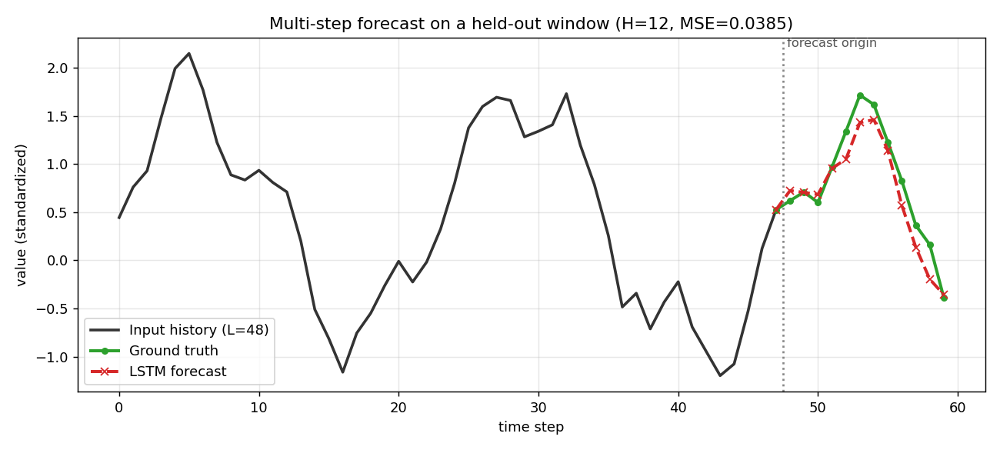

# LSTM Time-Series Forecasting

**Read the recent past, predict the near future.** This guide slices a signal into sliding windows and trains an LSTM to map the last `L` observations to the next `H` values — standard supervised, multi-step forecasting in Flax NNX, all on synthetic data that needs no download.

:::note Prerequisites
This builds directly on recurrent layers. Read [recurrent networks](/applications/sequence/recurrent-networks) for the `nnx.RNN` / `nnx.LSTMCell` API and the LSTM gate math, and [simple training](/basics/workflows/simple-training) for the NNX training loop.
:::

:::tip What you'll learn
- How to turn a raw 1-D series into `(window -> horizon)` supervised pairs with **sliding windows**
- How to build a **multi-step forecaster**: `nnx.RNN(nnx.LSTMCell)` encoder + a `nnx.Linear` head to `H` outputs
- Why forecasting uses an **MSE regression loss** instead of cross-entropy
- How to split *in time* and **standardize with train statistics only** so the future never leaks
- How to read the result: `test_mse` falling and the forecast tracking the held-out continuation
:::

:::info Example Code
See the full implementation: [`examples/sequence/time_series.py`](https://github.com/mlnomadpy/flaxdocs/tree/master/examples/sequence/time_series.py)
:::

## From a series to a supervised problem

A time series is a single long vector $s_1, s_2, \dots, s_T$. To train a model with mini-batches we reframe forecasting as ordinary supervised learning using a **sliding window**. Pick an input length $L$ (the *lookback*) and a forecast length $H$ (the *horizon*). Every position $i$ yields one training pair:

$$
\underbrace{(s_i, s_{i+1}, \dots, s_{i+L-1})}_{\text{input window } x^{(i)}}
\;\longrightarrow\;
\underbrace{(s_{i+L}, \dots, s_{i+L+H-1})}_{\text{target } y^{(i)}}
$$

Sliding the window by one step across the series produces $N = T - L - H + 1$ overlapping examples. The model learns a single function $f_\theta: \mathbb{R}^{L} \to \mathbb{R}^{H}$ that it applies at every position — the same weight-sharing idea that makes recurrence work, now lifted to the dataset level.

### This is *not* meta-learning

If you have seen the MAML sine-wave example, note the difference: there each sine wave is a **separate task** and the model adapts from a handful of shots. Here there is **one** series and **one** task; we simply cut it into many windows and do standard batched gradient descent. No inner loop, no fast weights.

## The data: sum of sinusoids

Real univariate series — energy load, temperature, request rates — are dominated by a few periodic components riding on noise. We synthesize exactly that, so the example is fully offline and reproducible:

$$
s_t = \sin\!\left(\tfrac{2\pi t}{24}\right)
    + 0.5\,\sin\!\left(\tfrac{2\pi t}{168}\right)
    + 0.3\,\sin\!\left(\tfrac{2\pi t}{7}\right)
    + 0.1\,\varepsilon_t,\qquad \varepsilon_t \sim \mathcal{N}(0,1)
$$

The periodic terms make the future *predictable* from the past; the noise term stops the LSTM from memorizing and forces it to learn the underlying structure.

```python
import jax
import jax.numpy as jnp


def make_series(length, *, seed=0):
    t = jnp.arange(length, dtype=jnp.float32)
    series = (
        1.0 * jnp.sin(2 * jnp.pi * t / 24.0)     # daily-like cycle
        + 0.5 * jnp.sin(2 * jnp.pi * t / 168.0)  # weekly-like cycle
        + 0.3 * jnp.sin(2 * jnp.pi * t / 7.0)    # short ripple
    )
    noise = 0.1 * jax.random.normal(jax.random.key(seed), (length,))
    return series + noise
```

We `vmap` a `dynamic_slice` to cut every window in one vectorized shot, adding a trailing feature axis so the shape is `(N, L, 1)` — exactly what `nnx.RNN` expects:

```python
def make_windows(series, window, horizon):
    n = series.shape[0] - window - horizon + 1
    starts = jnp.arange(n)
    x = jax.vmap(lambda s: jax.lax.dynamic_slice(series, (s,), (window,)))(starts)
    y = jax.vmap(lambda s: jax.lax.dynamic_slice(series, (s + window,), (horizon,)))(starts)
    return x[..., None], y   # (N, window, 1), (N, horizon)
```

**Split in time, then standardize with train stats only.** We cut the series into a past (train) and a future (test) *before* windowing, compute the mean and std on the training region alone, and apply them everywhere. Standardizing with future statistics would leak information the model could never have at inference time.

```python
split = int(0.8 * length)
mean = series[:split].mean()
std = series[:split].std() + 1e-6
series = (series - mean) / std
```

## The model in Flax NNX

The forecaster is a two-line module: an LSTM encoder over the window, then a linear projection from the final hidden state to all `H` future values at once (a *direct* multi-step forecast).

```python
from flax import nnx


class LSTMForecaster(nnx.Module):
    def __init__(self, in_features, hidden, horizon, *, rngs: nnx.Rngs):
        self.rnn = nnx.RNN(nnx.LSTMCell(in_features, hidden, rngs=rngs))
        self.head = nnx.Linear(hidden, horizon, rngs=rngs)

    def __call__(self, x):
        h = self.rnn(x)             # (B, L, in_features) -> (B, L, hidden)
        return self.head(h[:, -1])  # last step           -> (B, horizon)
```

`nnx.RNN` scans the `nnx.LSTMCell` across the time axis and returns every step's hidden state, `(B, L, hidden)`. We keep the **last** state `h[:, -1]` — it has integrated the entire lookback — and the head maps it to the `H`-step forecast. For a univariate series `in_features = 1`; for multivariate input you would simply stack channels on the last axis.

## The training step

Forecasting is regression, so the loss is **mean squared error**, not cross-entropy. Everything else is the standard NNX pattern: `nnx.value_and_grad` with `has_aux=True` to also return predictions, then `optimizer.update(model, grads)`.

```python
import optax
from shared.training_utils import compute_mse_loss


@nnx.jit
def train_step(model, optimizer, batch):
    def loss_fn(model):
        preds = model(batch["x"])            # (B, horizon)
        loss = compute_mse_loss(preds, batch["y"])
        return loss, preds

    (loss, preds), grads = nnx.value_and_grad(loss_fn, has_aux=True)(model)
    optimizer.update(model, grads)
    return loss, preds
```

Build the model and optimizer explicitly, then loop over shuffled windows:

```python
model = LSTMForecaster(in_features=1, hidden=64, horizon=12, rngs=nnx.Rngs(0))
optimizer = nnx.Optimizer(model, optax.adam(5e-3), wrt=nnx.Param)

for epoch in range(40):
    perm = jax.random.permutation(jax.random.key(epoch), n)
    for i in range(0, n - batch_size + 1, batch_size):
        idx = perm[i:i + batch_size]
        loss, _ = train_step(model, optimizer, {"x": x_tr[idx], "y": y_tr[idx]})
```

## Results / What to Expect

With a lookback of 48 and a horizon of 12, both the training and held-out MSE fall steadily as the LSTM locks onto the periodic structure. Because the test windows are a genuine continuation of the series, the falling `test_mse` is real generalization, not memorization:

```console
$ python sequence/time_series.py
train_windows=350 test_windows=92 window=48 horizon=12 epochs=40 batch=64
epoch  0  train_mse 0.7987  test_mse 0.7126
epoch  5  train_mse 0.2200  test_mse 0.2149
epoch 10  train_mse 0.1280  test_mse 0.1634
epoch 20  train_mse 0.0723  test_mse 0.0781
epoch 30  train_mse 0.0333  test_mse 0.0470
epoch 39  train_mse 0.0255  test_mse 0.0382
held-out forecast MSE (first window): 0.0385
forecast[:4] [0.725 0.705 0.684 0.955]  truth[:4] [0.62  0.71  0.6   0.968]
```

The forecast on the first held-out window tracks the true continuation closely — the predicted values sit right next to the ground truth in standardized units. Environment knobs `EPOCHS`, `BATCH`, and `SYNTHETIC` scale the run; `SYNTHETIC=0` uses a longer 2048-step series.



*The model reads the solid black lookback window, and past the forecast-origin line its 12-step forecast (red, dashed) closely follows the true continuation (green) it never saw — direct visual evidence that the LSTM has learned the series' periodic structure rather than memorizing it.*

## Common Pitfalls

- ❌ Feeding a flat `(B, L)` window into `nnx.RNN` and getting a shape error.
  ✅ The RNN needs a feature axis: reshape to `(B, L, 1)` for univariate input (stack channels for multivariate).

- ❌ Standardizing the whole series (or the test split) with global mean/std.
  ✅ Compute statistics on the **training region only** and reuse them — future stats leak information you won't have at inference.

- ❌ Predicting one step and calling `H` steps done, or looping the model on its own noisy outputs without training for it.
  ✅ Emit all `H` values at once with a `nnx.Linear(hidden, H)` head (direct multi-step) so every horizon step gets its own trained weights.

- ❌ Reaching for `compute_cross_entropy_loss` because other sequence guides use it.
  ✅ Forecasting is regression over continuous values — use **MSE** (`compute_mse_loss`).

- ❌ Judging quality by raw MSE alone.
  ✅ Compare against a **naive persistence baseline** (repeat the last observed value); a useful model must beat it.

## Next steps

- [Word2Vec](/applications/sequence/word2vec) — learn dense representations from sequences instead of forecasting them.
- [Simple Transformer](/basics/text/simple-transformer) — attention replaces the recurrent scan and forecasts every position in parallel.

## Complete Example

Full runnable script with the synthetic series, sliding-window builder, time-based split, and training loop: [`examples/sequence/time_series.py`](https://github.com/mlnomadpy/flaxdocs/tree/master/examples/sequence/time_series.py).

## References

- Hochreiter & Schmidhuber (1997), *Long Short-Term Memory* — [Neural Computation 9(8)](https://doi.org/10.1162/neco.1997.9.8.1735).
- Lim & Zohren (2020), *Time Series Forecasting With Deep Learning: A Survey* — [arXiv:2004.13408](https://arxiv.org/abs/2004.13408).
- Salinas et al. (2019), *DeepAR: Probabilistic Forecasting with Autoregressive Recurrent Networks* — [arXiv:1704.04110](https://arxiv.org/abs/1704.04110).
- Hewamalage, Bergmeir & Bandara (2019), *Recurrent Neural Networks for Time Series Forecasting: Current Status and Future Directions* — [arXiv:1909.00590](https://arxiv.org/abs/1909.00590).
