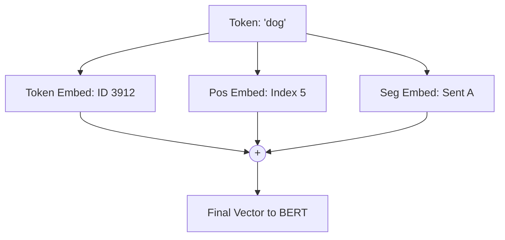

# BERT (Bidirectional Transformers)

BERT (Bidirectional Encoder Representations from Transformers) is designed to "read" text in both directions at once. To understand how it works, we need to break down its two key components: **Input Embeddings** and **Self-Attention**.

## 1. Input: Understanding the Summation

BERT doesn't just see a word. It sees a combination of **what** the word is, **where** it is, and **which sentence** it belongs to.

$$
E_{input} = E_{token} + E_{position} + E_{segment}
$$



-   **Token Embedding**: Standard look-up. "dog" -> `[0.1, -0.5, ...]`
-   **Position Embedding**: Since self-attention has no order, we *add* a learned vector for "Position 5".
-   **Segment Embedding**: Useful for tasks with two sentences (e.g., Q&A).

## 2. Self-Attention: The Mathematical Core

The heart of BERT is **Multi-Head Scaled Dot-Product Attention**.

$$
\text{Attention}(Q, K, V) = \text{softmax}\left(\frac{QK^T}{\sqrt{d_k}}\right)V
$$

### Implementation (Cell 1)

```python
from flax import linen as nnx
import jax.numpy as jnp
import jax

class BERTAttention(nnx.Module):
    def __init__(self, hidden_size: int = 768, num_heads: int = 12, *, rngs: nnx.Rngs):
        self.num_heads = num_heads
        self.head_dim = hidden_size // num_heads
        
        self.query = nnx.Linear(hidden_size, hidden_size, rngs=rngs)
        self.key = nnx.Linear(hidden_size, hidden_size, rngs=rngs)
        self.value = nnx.Linear(hidden_size, hidden_size, rngs=rngs)
        self.out = nnx.Linear(hidden_size, hidden_size, rngs=rngs)

    def __call__(self, x):
        B, L, H = x.shape
        
        # 1. Project to Q, K, V
        q = self.query(x).reshape(B, L, self.num_heads, self.head_dim).transpose(0, 2, 1, 3)
        k = self.key(x).reshape(B, L, self.num_heads, self.head_dim).transpose(0, 2, 1, 3)
        v = self.value(x).reshape(B, L, self.num_heads, self.head_dim).transpose(0, 2, 1, 3)
        
        # 2. Scaled Dot Product
        scores = jnp.matmul(q, k.swapaxes(-1, -2)) / jnp.sqrt(self.head_dim)
        
        # 3. Softmax & Recombine
        weights = jax.nn.softmax(scores, axis=-1)
        context = jnp.matmul(weights, v)
        
        # Transpose back
        context = context.transpose(0, 2, 1, 3).reshape(B, L, H)
        return self.out(context)
```

## 3. Masked Language Modeling (MLM)

How do we train a bidirectional model? We **hide** some words and ask the model to guess them.

$$
L_{MLM} = - \sum_{i \in \text{masked}} \log P(x_i | \hat{x})
$$

### Data Streaming & Masking (Cell 2)
We assume we have a stream of Text. We apply the **80-10-10 logic**: 15% chosen, then 80% masked, 10% random, 10% identity.

```python
import numpy as np
from datasets import load_dataset
from transformers import AutoTokenizer

# Load Dataset Stream
dataset = load_dataset("HuggingFaceFW/fineweb-edu", name="sample-10BT", split="train", streaming=True)
dataset = dataset.shuffle(buffer_size=10_000)
tokenizer = AutoTokenizer.from_pretrained('bert-base-uncased')

def prepare_batch(examples):
    # 1. Tokenize
    encodings = tokenizer(examples['text'], truncation=True, padding='max_length', 
                        max_length=128, return_tensors='np')
    input_ids = encodings['input_ids']
    
    # 2. Setup Masking
    labels = input_ids.copy()
    rand = np.random.rand(*input_ids.shape)
    # Mask 15% of tokens (ignore PAD)
    mask = (rand < 0.15) & (input_ids != tokenizer.pad_token_id)
    
    # 3. Replace with [MASK]
    input_ids[mask] = tokenizer.mask_token_id
    
    # 4. Set unmasked labels to -100 (Ignore Index)
    labels[~mask] = -100
    
    return {'input_ids': input_ids, 'labels': labels, 'attention_mask': encodings['attention_mask']}

# Create Mapped Stream
train_loader = dataset.map(prepare_batch, batched=True, batch_size=32, remove_columns=['text'])
iterator = iter(train_loader)
```

## 4. Training Loop

We need a custom training step to handle that special `-100` label logic.

### Define Training Step (Cell 3)

```python
import optax
from flax.training import train_state

@jax.jit
def train_step(state, batch):
    def loss_fn(params):
        logits = state.apply_fn(
            {'params': params}, 
            batch['input_ids'], 
            batch['attention_mask'], 
            train=True
        ) # (B, Seq, Vocab)
        
        # Calculate Loss
        loss = optax.softmax_cross_entropy_with_integer_labels(logits, batch['labels'])
        
        # Filter Loss: Only track masked tokens (label != -100)
        mask = batch['labels'] != -100
        loss = (loss * mask).sum() / (mask.sum() + 1e-6)
        
        return loss

    grad_fn = jax.value_and_grad(loss_fn)
    loss, grads = grad_fn(state.params)
    state = state.apply_gradients(grads=grads)
    return state, loss
```

### Run Execution (Cell 4)

```python
# Initialize
# (Assuming BERT class is defined as previously shown using BERTAttention)
class BERT(nnx.Module):
    # ... Simplified definition for context ...
    def __init__(self, vocab=30522, *, rngs):
        self.embed = nnx.Embed(vocab, 768, rngs=rngs)
        self.enc = BERTAttention(rngs=rngs) # Simplified: just 1 layer for demo
        self.head = nnx.Linear(768, vocab, rngs=rngs)
    def __call__(self, x, mask, train=True):
        x = self.embed(x)
        x = self.enc(x)
        return self.head(x)

model = BERT(rngs=nnx.Rngs(0))
dummy = jnp.ones((1, 128), dtype=jnp.int32)
variables = model.init(nnx.Rngs(0), dummy, dummy)

state = train_state.TrainState.create(
    apply_fn=model.apply,
    params=variables['params'],
    tx=optax.adamw(1e-4),
)

# Execution
print("Training BERT...")
for step in range(100):
    data = next(iterator)
    batch = {k: jnp.array(v) for k, v in data.items()}
    
    state, loss = train_step(state, batch)
    
    if step % 10 == 0:
        print(f"Step {step} | Loss {loss:.4f}")
```
