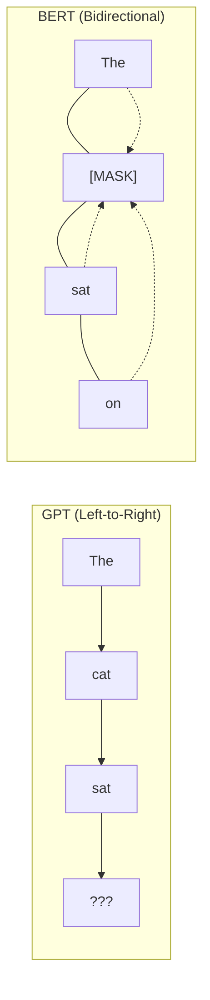
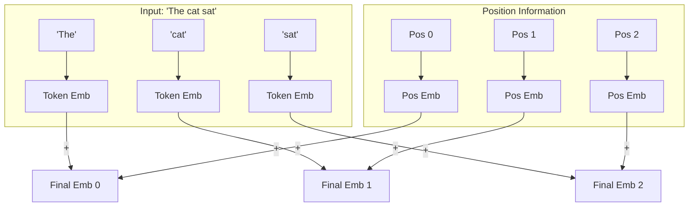
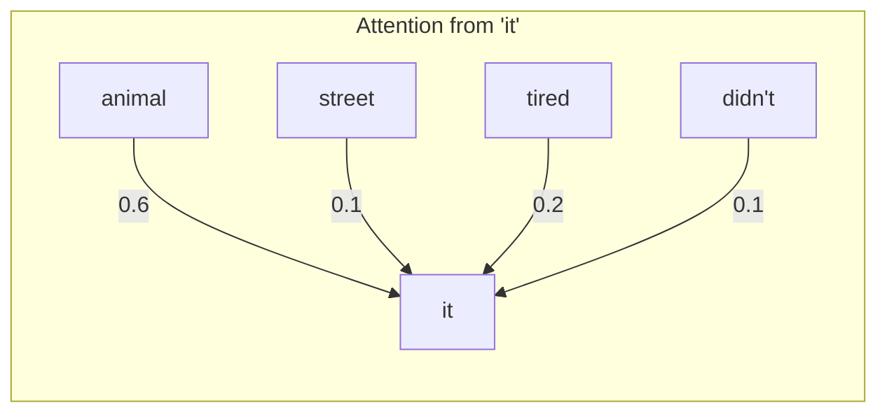
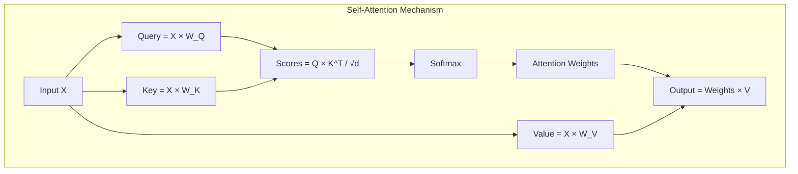
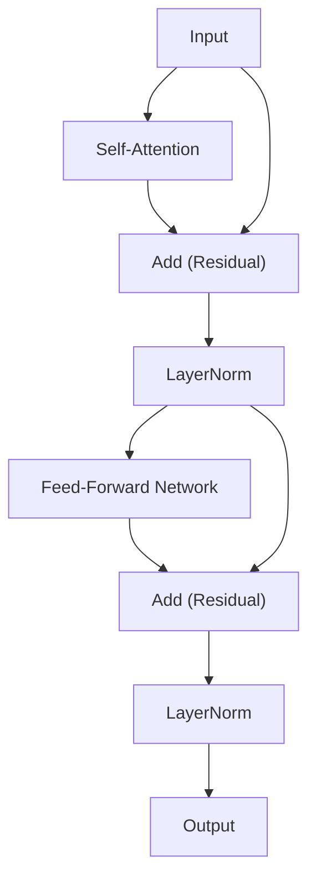

# BERT: Understanding Bidirectional Transformers

BERT changed NLP forever. Before BERT, models read text like we read a mystery novel—left to right, guessing what comes next. BERT reads like a detective reviewing evidence—looking at everything at once to understand the full picture.

> **The Key Insight**: To understand what "bank" means in "I went to the bank to deposit money," you need to see "deposit" and "money" which come *after* "bank." BERT sees everything simultaneously.

---

## How BERT Sees Text

Unlike GPT (which predicts the next word), BERT predicts **missing words**. This is called **Masked Language Modeling (MLM)**.



**Why does this matter?** 
- GPT can only use "The" to predict "cat" → limited context.
- BERT uses "The", "sat", and "on" together → much richer understanding.

---

## 1. Input Embeddings: How BERT "Reads" Tokens

Before BERT can process text, it needs to convert words into numbers. But a single number isn't enough—BERT needs to know:

1. **What is this word?** → Token Embedding
2. **Where is it in the sentence?** → Position Embedding  
3. **Which sentence is it from?** → Segment Embedding (for tasks with two sentences)



$$E_{input} = E_{token} + E_{position} + E_{segment}$$

**Why add them instead of concatenate?** Addition is cheaper (no extra dimensions) and works surprisingly well because each embedding lives in a different "subspace" of the high-dimensional vector.

```python
from flax import nnx
import jax
import jax.numpy as jnp

class BERTEmbeddings(nnx.Module):
    """Converts token IDs into rich vector representations."""
    
    def __init__(self, vocab_size: int, max_len: int, hidden_size: int, *, rngs: nnx.Rngs):
        # Each token gets a unique vector
        self.token_emb = nnx.Embed(vocab_size, hidden_size, rngs=rngs)
        # Each position gets a unique vector  
        self.pos_emb = nnx.Embed(max_len, hidden_size, rngs=rngs)
        # Normalize to stabilize training
        self.norm = nnx.LayerNorm(hidden_size, rngs=rngs)
        self.dropout = nnx.Dropout(0.1, rngs=rngs)

    def __call__(self, x, training: bool = True):
        B, L = x.shape
        # Create position IDs: [0, 1, 2, ..., L-1]
        positions = jnp.arange(L)[None, :]  # Shape: [1, L]
        
        # Look up embeddings and add them
        embeddings = self.token_emb(x) + self.pos_emb(positions)
        
        # Normalize and apply dropout
        return self.dropout(self.norm(embeddings), deterministic=not training)
```

---

## 2. Self-Attention: How BERT Connects Words

Self-attention is BERT's superpower. It lets every word "look at" every other word and decide what's important.

### The Intuition

Imagine you're trying to understand "The animal didn't cross the street because **it** was too tired."

What does "it" refer to? You need to look at the context:
- "animal" → likely referent
- "street" → probably not

Self-attention computes a **relevance score** between every pair of words.



### The Math: Query, Key, Value

We transform each word into three vectors:
- **Query (Q)**: "What am I looking for?"
- **Key (K)**: "What do I contain?"
- **Value (V)**: "What information do I provide?"

$$Q = XW^Q, \quad K = XW^K, \quad V = XW^V$$

The attention score between word $i$ and word $j$ is:

$$\text{score}_{ij} = \frac{Q_i \cdot K_j}{\sqrt{d_k}}$$

**Why divide by $\sqrt{d_k}$?** Without scaling, the dot products grow large as dimensions increase, making softmax outputs extremely peaked (almost one-hot). Scaling keeps gradients healthy.



$$\text{Attention}(Q, K, V) = \text{softmax}\left(\frac{QK^T}{\sqrt{d_k}}\right) V$$

```python
class BERTAttention(nnx.Module):
    """Multi-head self-attention: lets each word attend to all other words."""
    
    def __init__(self, hidden_size: int = 768, num_heads: int = 12, *, rngs: nnx.Rngs):
        self.num_heads = num_heads
        self.head_dim = hidden_size // num_heads
        
        # Separate projections for Q, K, V
        self.q_proj = nnx.Linear(hidden_size, hidden_size, rngs=rngs)
        self.k_proj = nnx.Linear(hidden_size, hidden_size, rngs=rngs)
        self.v_proj = nnx.Linear(hidden_size, hidden_size, rngs=rngs)
        self.out_proj = nnx.Linear(hidden_size, hidden_size, rngs=rngs)

    def __call__(self, x):
        B, L, H = x.shape
        
        # Step 1: Project to Q, K, V
        q = self.q_proj(x)  # [B, L, H]
        k = self.k_proj(x)
        v = self.v_proj(x)
        
        # Step 2: Split into multiple heads
        # Reshape: [B, L, H] -> [B, L, num_heads, head_dim] -> [B, num_heads, L, head_dim]
        q = q.reshape(B, L, self.num_heads, self.head_dim).transpose(0, 2, 1, 3)
        k = k.reshape(B, L, self.num_heads, self.head_dim).transpose(0, 2, 1, 3)
        v = v.reshape(B, L, self.num_heads, self.head_dim).transpose(0, 2, 1, 3)
        
        # Step 3: Compute attention scores
        scale = 1.0 / jnp.sqrt(self.head_dim)
        scores = jnp.matmul(q, k.swapaxes(-1, -2)) * scale  # [B, heads, L, L]
        
        # Step 4: Softmax to get probabilities
        weights = jax.nn.softmax(scores, axis=-1)
        
        # Step 5: Weighted sum of values
        context = jnp.matmul(weights, v)  # [B, heads, L, head_dim]
        
        # Step 6: Concatenate heads back together
        context = context.transpose(0, 2, 1, 3).reshape(B, L, H)
        
        return self.out_proj(context)
```

### Why Multiple Heads?

One attention pattern isn't enough. Different heads learn different relationships:
- Head 1: Syntactic (subject-verb agreement)
- Head 2: Coreference ("it" → "animal")
- Head 3: Semantic similarity

---

## 3. The Transformer Layer: Putting It Together

Each BERT layer follows a simple pattern:



### The Feed-Forward Network

After attention, each token is processed independently through a small neural network:

$$\text{FFN}(x) = \text{GELU}(xW_1 + b_1)W_2 + b_2$$

**Why expand then contract?** The FFN expands from 768 → 3072 dimensions, then contracts back. This allows the network to compute complex transformations in a higher-dimensional space.

```python
class BERTLayer(nnx.Module):
    """One layer of BERT: Attention + FFN with residual connections."""
    
    def __init__(self, hidden_size: int, num_heads: int, *, rngs: nnx.Rngs):
        self.attention = BERTAttention(hidden_size, num_heads, rngs=rngs)
        self.norm1 = nnx.LayerNorm(hidden_size, rngs=rngs)
        self.norm2 = nnx.LayerNorm(hidden_size, rngs=rngs)
        self.dropout = nnx.Dropout(0.1, rngs=rngs)
        
        # FFN: expand 4x, then contract
        intermediate = hidden_size * 4
        self.ffn = nnx.Sequential(
            nnx.Linear(hidden_size, intermediate, rngs=rngs),
            nnx.gelu,
            nnx.Linear(intermediate, hidden_size, rngs=rngs)
        )

    def __call__(self, x, training: bool = True):
        # Attention block with residual
        attn_out = self.attention(x)
        x = self.norm1(x + self.dropout(attn_out, deterministic=not training))
        
        # FFN block with residual
        ffn_out = self.ffn(x)
        x = self.norm2(x + self.dropout(ffn_out, deterministic=not training))
        
        return x
```

---

## 4. The Complete BERT Model

Stack 12 layers, add an embedding layer and a prediction head:

```python
class BERT(nnx.Module):
    """Complete BERT model for Masked Language Modeling."""
    
    def __init__(self, vocab_size=30522, hidden_size=768, num_layers=12, 
                 num_heads=12, max_len=512, *, rngs: nnx.Rngs):
        self.embeddings = BERTEmbeddings(vocab_size, max_len, hidden_size, rngs=rngs)
        self.layers = [
            BERTLayer(hidden_size, num_heads, rngs=rngs) 
            for _ in range(num_layers)
        ]
        # MLM Head: predict original token
        self.head = nnx.Linear(hidden_size, vocab_size, rngs=rngs)

    def __call__(self, input_ids, training: bool = True):
        # Embed tokens
        x = self.embeddings(input_ids, training=training)
        
        # Pass through all transformer layers
        for layer in self.layers:
            x = layer(x, training=training)
        
        # Predict vocabulary distribution
        return self.head(x)
```

---

## 5. Training BERT: The Masking Game

BERT learns by playing a fill-in-the-blank game. We hide 15% of words and ask BERT to guess them.

### The 80/10/10 Rule

We don't always use `[MASK]`. This prevents BERT from only learning to predict masks:

| Action | Probability | Example |
|--------|-------------|---------|
| Replace with `[MASK]` | 80% | "The cat sat" → "The [MASK] sat" |
| Replace with random word | 10% | "The cat sat" → "The dog sat" |
| Keep original | 10% | "The cat sat" → "The cat sat" |

```python
import numpy as np

def mask_tokens(tokens, vocab_size, mask_token_id, mask_prob=0.15):
    """Apply BERT's 80/10/10 masking strategy."""
    labels = np.full(len(tokens), -100)  # -100 = ignore in loss
    
    # Choose 15% of positions to mask
    num_to_mask = int(len(tokens) * mask_prob)
    mask_positions = np.random.choice(len(tokens), num_to_mask, replace=False)
    
    for pos in mask_positions:
        labels[pos] = tokens[pos]  # Store true token for loss
        
        roll = np.random.random()
        if roll < 0.8:
            tokens[pos] = mask_token_id  # 80%: [MASK]
        elif roll < 0.9:
            tokens[pos] = np.random.randint(0, vocab_size)  # 10%: random
        # else: 10% keep original
    
    return tokens, labels
```

---

## 6. Scaling Up: Distributed Training

For production BERT training, we distribute across multiple GPUs/TPUs:

```python
from jax.sharding import Mesh, NamedSharding, PartitionSpec as P
import optax

# Create a mesh of devices
devices = jax.devices()
mesh = Mesh(np.array(devices), ('batch',))

# Shard data across batch dimension
data_sharding = NamedSharding(mesh, P('batch', None))

@nnx.jit
def train_step(model, optimizer, batch):
    def loss_fn(model):
        logits = model(batch['input_ids'], training=True)
        
        # Cross-entropy loss, but only on masked tokens
        loss = optax.softmax_cross_entropy_with_integer_labels(logits, batch['labels'])
        mask = batch['labels'] != -100
        return (loss * mask).sum() / (mask.sum() + 1e-6)
    
    loss, grads = nnx.value_and_grad(loss_fn)(model)
    optimizer.update(grads)
    return loss
```

---

## Limitations & What Came Next

BERT was revolutionary, but not perfect:

| Limitation | Why It Matters | Solution |
|------------|---------------|----------|
| **O(N²) Attention** | Can't handle long documents | FlashAttention, Longformer |
| **Only 15% Training Signal** | Wastes 85% of tokens | ELECTRA (trains on all tokens) |
| **Can't Generate** | Not suitable for chatbots | GPT, T5 |

> **The Takeaway**: BERT showed that bidirectional understanding is powerful. Modern models like ELECTRA improved training efficiency, while encoder-decoder models like T5 combined BERT's understanding with generation capability.
