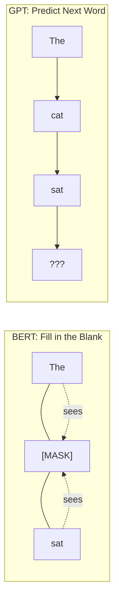
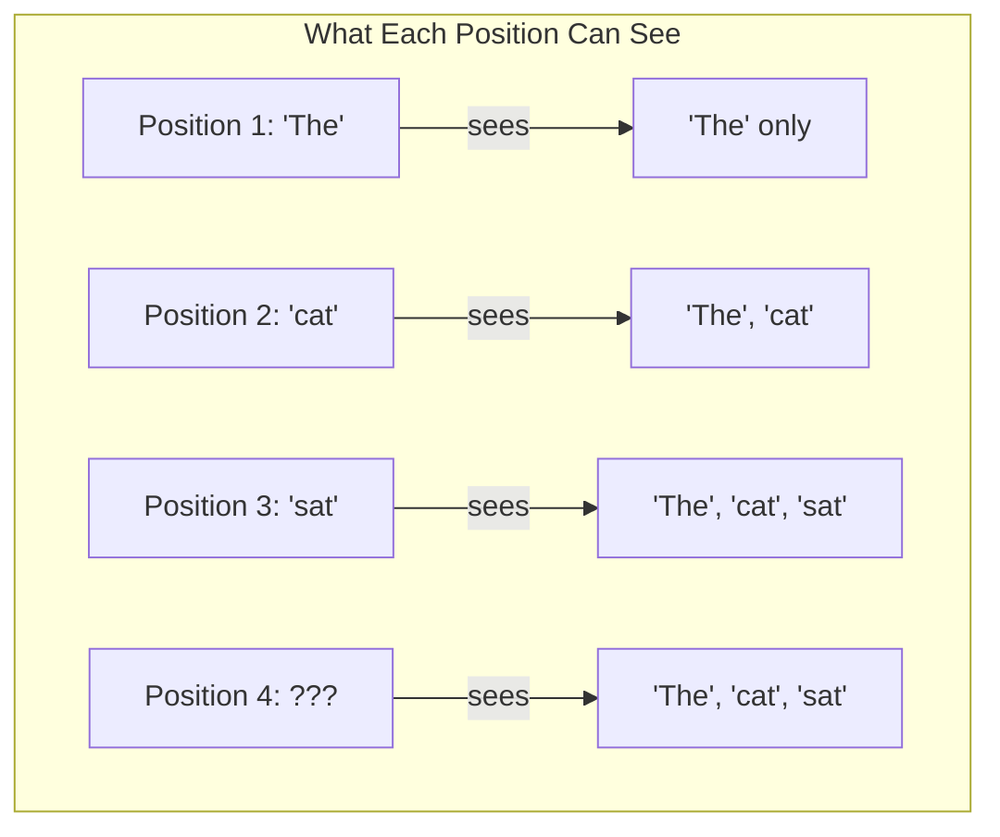
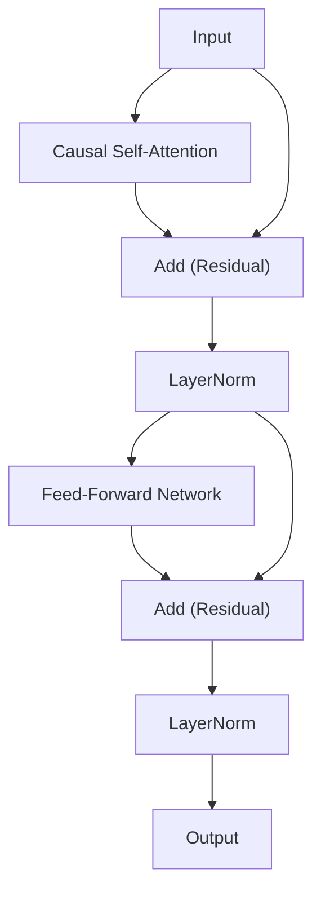
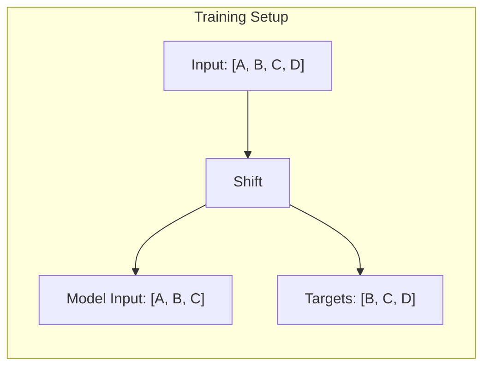
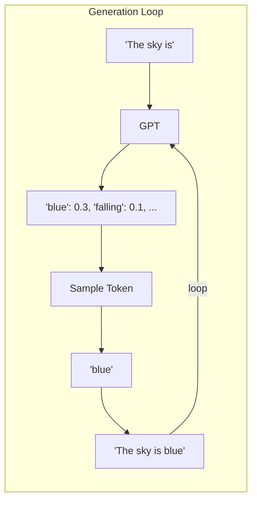
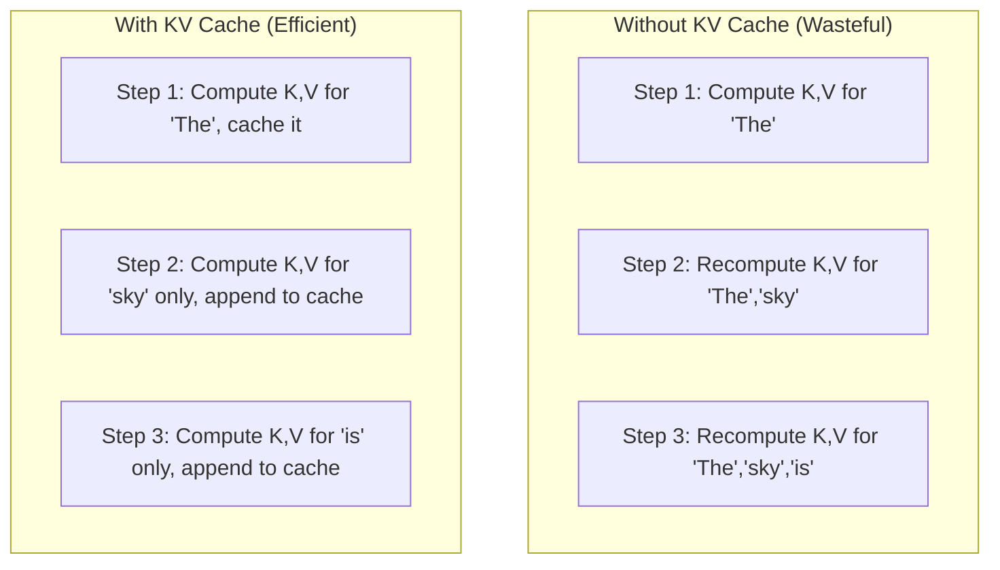

# GPT: Understanding Autoregressive Language Models

GPT (Generative Pre-trained Transformer) is the architecture behind ChatGPT, Claude, and most modern AI assistants. While BERT reads text bidirectionally, GPT reads left-to-right—and this simple difference makes it excellent at *generating* text.

> **The Key Insight**: GPT predicts the next word given all previous words. By training on billions of sentences, it learns patterns like "The sky is ___" → "blue". Stack enough of these predictions together, and you get coherent paragraphs.

---

## How GPT Differs from BERT



| Aspect | BERT | GPT |
|--------|------|-----|
| Direction | Bidirectional | Left-to-right |
| Task | Fill in blanks (MLM) | Predict next word |
| Best for | Understanding | Generating |
| Attention | Full (all tokens) | Causal (past only) |

---

## 1. The Causal Mask: Why GPT Can't Peek

The magic of GPT is the **causal mask**. When predicting word 3, GPT can only see words 1 and 2—never words 4, 5, 6...

### Why is this necessary?

Without the mask, during training the model could "cheat" by looking at the answer. The causal mask forces the model to genuinely learn to predict.



### The Mask as a Matrix

The causal mask is a lower triangular matrix. Zeros become $-\infty$ before softmax, making those positions contribute zero attention:

$$
\text{Mask} = \begin{bmatrix} 
1 & 0 & 0 & 0 \\
1 & 1 & 0 & 0 \\
1 & 1 & 1 & 0 \\
1 & 1 & 1 & 1
\end{bmatrix}
$$

After masking:
$$
\text{Scores} = \begin{bmatrix} 
0.8 & -\infty & -\infty & -\infty \\
0.3 & 0.7 & -\infty & -\infty \\
0.2 & 0.4 & 0.6 & -\infty \\
0.1 & 0.3 & 0.5 & 0.9
\end{bmatrix}
$$

When softmax is applied, $e^{-\infty} = 0$, so masked positions get zero weight.

```python
from flax import nnx
import jax
import jax.numpy as jnp

class CausalSelfAttention(nnx.Module):
    """Self-attention with causal masking for autoregressive generation."""
    
    def __init__(self, hidden_size: int = 768, num_heads: int = 12, *, rngs: nnx.Rngs):
        self.num_heads = num_heads
        self.head_dim = hidden_size // num_heads
        
        # Combined QKV projection for efficiency
        self.qkv_proj = nnx.Linear(hidden_size, hidden_size * 3, rngs=rngs)
        self.out_proj = nnx.Linear(hidden_size, hidden_size, rngs=rngs)

    def __call__(self, x):
        B, L, H = x.shape
        
        # Step 1: Project to Q, K, V in one shot
        qkv = self.qkv_proj(x)  # [B, L, 3*H]
        qkv = qkv.reshape(B, L, 3, self.num_heads, self.head_dim)
        qkv = qkv.transpose(2, 0, 3, 1, 4)  # [3, B, heads, L, head_dim]
        q, k, v = qkv[0], qkv[1], qkv[2]
        
        # Step 2: Compute attention scores
        scale = 1.0 / jnp.sqrt(self.head_dim)
        scores = jnp.matmul(q, k.swapaxes(-1, -2)) * scale  # [B, heads, L, L]
        
        # Step 3: Apply causal mask
        # Create lower triangular mask
        mask = jnp.tril(jnp.ones((L, L)))
        # Where mask is 0, replace score with -infinity
        scores = jnp.where(mask == 1, scores, -1e9)
        
        # Step 4: Softmax (masked positions become 0)
        weights = jax.nn.softmax(scores, axis=-1)
        
        # Step 5: Weighted sum and recombine heads
        context = jnp.matmul(weights, v)  # [B, heads, L, head_dim]
        context = context.transpose(0, 2, 1, 3).reshape(B, L, H)
        
        return self.out_proj(context)
```

---

## 2. The Transformer Block

GPT uses the same building blocks as BERT, just with causal attention:



```python
class GPTLayer(nnx.Module):
    """One GPT transformer layer."""
    
    def __init__(self, hidden_size: int, num_heads: int, *, rngs: nnx.Rngs):
        self.attention = CausalSelfAttention(hidden_size, num_heads, rngs=rngs)
        self.norm1 = nnx.LayerNorm(hidden_size, rngs=rngs)
        self.norm2 = nnx.LayerNorm(hidden_size, rngs=rngs)
        self.dropout = nnx.Dropout(0.1, rngs=rngs)
        
        intermediate = hidden_size * 4
        self.ffn = nnx.Sequential(
            nnx.Linear(hidden_size, intermediate, rngs=rngs),
            nnx.gelu,
            nnx.Linear(intermediate, hidden_size, rngs=rngs)
        )

    def __call__(self, x, training: bool = True):
        # Attention with residual
        attn_out = self.attention(x)
        x = self.norm1(x + self.dropout(attn_out, deterministic=not training))
        
        # FFN with residual
        ffn_out = self.ffn(x)
        x = self.norm2(x + self.dropout(ffn_out, deterministic=not training))
        
        return x
```

---

## 3. The Complete GPT Model

```python
class GPT(nnx.Module):
    """Complete GPT model for language modeling."""
    
    def __init__(self, vocab_size: int = 50257, hidden_size: int = 768, 
                 num_layers: int = 12, num_heads: int = 12, max_len: int = 1024, 
                 *, rngs: nnx.Rngs):
        # Embeddings
        self.token_emb = nnx.Embed(vocab_size, hidden_size, rngs=rngs)
        self.pos_emb = nnx.Embed(max_len, hidden_size, rngs=rngs)
        self.dropout = nnx.Dropout(0.1, rngs=rngs)
        
        # Transformer layers
        self.layers = [
            GPTLayer(hidden_size, num_heads, rngs=rngs) 
            for _ in range(num_layers)
        ]
        
        # Final normalization and prediction head
        self.norm = nnx.LayerNorm(hidden_size, rngs=rngs)
        self.head = nnx.Linear(hidden_size, vocab_size, rngs=rngs)

    def __call__(self, input_ids, training: bool = True):
        B, L = input_ids.shape
        positions = jnp.arange(L)[None, :]
        
        # Combine token and position embeddings
        x = self.token_emb(input_ids) + self.pos_emb(positions)
        x = self.dropout(x, deterministic=not training)
        
        # Pass through transformer layers
        for layer in self.layers:
            x = layer(x, training=training)
        
        # Final norm and project to vocabulary
        x = self.norm(x)
        return self.head(x)
```

---

## 4. Training: The Shifting Trick

GPT is trained to predict the next token at every position. We do this cleverly in parallel:



At position 0, the model sees `[A]` and predicts `B`.  
At position 1, the model sees `[A, B]` and predicts `C`.  
At position 2, the model sees `[A, B, C]` and predicts `D`.

```python
import optax

@nnx.jit
def train_step(model, optimizer, batch):
    """Training step with teacher forcing."""
    
    def loss_fn(model):
        # Shift: input is [:-1], target is [1:]
        inputs = batch[:, :-1]   # [A, B, C]
        targets = batch[:, 1:]   # [B, C, D]
        
        logits = model(inputs, training=True)
        loss = optax.softmax_cross_entropy_with_integer_labels(logits, targets)
        return loss.mean()
    
    loss, grads = nnx.value_and_grad(loss_fn)(model)
    optimizer.update(grads)
    return loss
```

---

## 5. Generation: Making GPT Talk

Once trained, GPT generates text one token at a time:



### Temperature: Controlling Creativity

**Temperature** controls how "random" the generation is:

$$P(x_i) = \frac{e^{z_i / T}}{\sum_j e^{z_j / T}}$$

| Temperature | Effect | Use Case |
|------------|--------|----------|
| T → 0 | Greedy (pick highest) | Factual answers |
| T = 1 | Original distribution | Balanced |
| T > 1 | More random | Creative writing |

```python
def generate(model, tokenizer, prompt: str, max_tokens: int = 50, temperature: float = 0.7):
    """Generate text autoregressively with temperature sampling."""
    
    # Encode the prompt
    input_ids = jnp.array(tokenizer.encode(prompt))[None, :]
    
    for _ in range(max_tokens):
        # Get predictions for the last token
        logits = model(input_ids, training=False)
        next_token_logits = logits[0, -1, :]
        
        # Apply temperature
        scaled_logits = next_token_logits / temperature
        
        # Sample from the distribution
        probs = jax.nn.softmax(scaled_logits)
        next_token = jax.random.categorical(
            jax.random.PRNGKey(int(time.time())), 
            jnp.log(probs)
        )
        
        # Append to sequence
        input_ids = jnp.concatenate([input_ids, next_token[None, None]], axis=1)
        
        # Stop if we hit end-of-text
        if next_token == tokenizer.eos_token_id:
            break
    
    return tokenizer.decode(input_ids[0])
```

---

## 6. The KV Cache: Efficient Generation

During generation, we compute attention over growing sequences. Without optimization, this is wasteful:



The **KV Cache** stores previously computed Key and Value vectors, so we only compute new tokens.

---

## Limitations & What Came Next

| Limitation | Why It Matters | Modern Solution |
|------------|---------------|-----------------|
| **Hallucinations** | Makes up plausible-sounding facts | RLHF (ChatGPT), Constitutional AI |
| **KV Cache Memory** | Grows linearly with context | GQA, MQA (fewer KV heads) |
| **Context Length** | Can't read entire books | Ring Attention, RoPE scaling |
| **No Reasoning** | Pattern matching, not logic | Chain-of-Thought, RAG |

> **The Takeaway**: GPT's simplicity—just predict the next token—scales remarkably well. Modern improvements focus on alignment (RLHF), efficiency (KV cache optimization), and reasoning (chain-of-thought).
