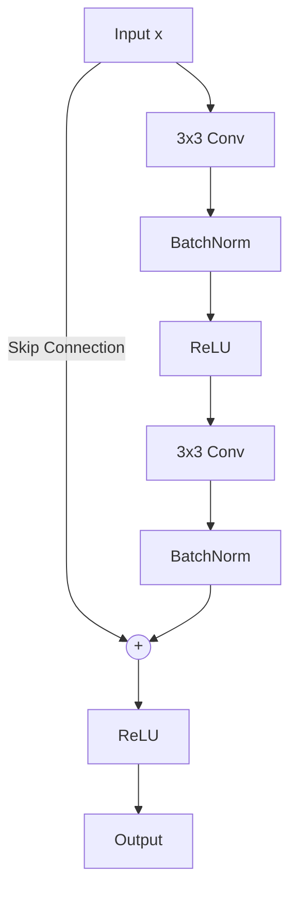

# ResNet (Residual Networks)

ResNet, introduced in 2015, revolutionized deep learning by enabling the training of incredibly deep networks (up to 1000 layers). Before ResNet, networks rarely exceeded 20-30 layers due to the **vanishing gradient problem**.

## The Vanishing Gradient Problem

In deep networks, gradients are backpropagated through the chain rule. As they pass through many layers, they are repeatedly multiplied by small weights and activation derivatives. This causes the gradient signal to vanish (approach zero) before reaching the early layers, meaning the early layers stop learning.

### The Residual Solution

ResNet introduces **Skip Connections**. Instead of learning a function $H(x)$, we learn a residual function $F(x) = H(x) - x$.

$$
y = \underbrace{F(x)}_{\text{learned layers}} + \underbrace{x}_{\text{skip connection}}
$$

1.  **Forward Pass**: Information flows directly from input to output.
2.  **Backward Pass**: Gradients flow through the "identity highway" ($+x$) without being diminished.

## 1. The Residual Block

The building block of ResNet consists of two convolutions. Let's build it step-by-step.



### Defining the Layers (Cell 1)
We need two main convolution layers. If the block is "downsampling" (reducing image size), the first convolution uses `stride=2`.

```python
from flax import linen as nnx
import jax.numpy as jnp

class ResidualBlock(nnx.Module):
    def __init__(self, features: int, stride: int = 1, *, rngs: nnx.Rngs):
        # Layer 1: Potentially downsamples (stride=2)
        self.conv1 = nnx.Conv(features, features, kernel_size=(3, 3), 
                             strides=(stride, stride), padding='SAME', use_bias=False, rngs=rngs)
        self.bn1 = nnx.BatchNorm(features, rngs=rngs)
        
        # Layer 2: Always stride=1
        self.conv2 = nnx.Conv(features, features, kernel_size=(3, 3), 
                             padding='SAME', use_bias=False, rngs=rngs)
        self.bn2 = nnx.BatchNorm(features, rngs=rngs)
        
        # Projection for Skip Connection if shapes don't match
        if stride != 1:
            self.shortcut = nnx.Sequential(
                nnx.Conv(features, features, kernel_size=(1, 1), 
                        strides=(stride, stride), use_bias=False, rngs=rngs),
                nnx.BatchNorm(features, rngs=rngs)
            )
        else:
            self.shortcut = lambda x, train: x

    def __call__(self, x, *, train: bool = True):
        # Path 1: Learned Features
        out = self.conv1(x)
        out = self.bn1(out, use_running_average=not train)
        out = nnx.relu(out)
        
        out = self.conv2(out)
        out = self.bn2(out, use_running_average=not train)
        
        # Path 2: Skip Connection
        if isinstance(self.shortcut, nnx.Sequential):
             residual = x
             for layer in self.shortcut.layers:
                 if isinstance(layer, nnx.BatchNorm):
                     residual = layer(residual, use_running_average=not train)
                 else:
                     residual = layer(residual)
        else:
             residual = self.shortcut(x, train=train)

        # Addition
        return nnx.relu(out + residual)
```

## 2. The Full Architecture (Cell 2)

Resnets are built of 4 stages. Each stage typically doubles the number of filters and halves the spatial resolution.

```python
class ResNet(nnx.Module):
    def __init__(self, num_classes: int = 1000, layers=[2, 2, 2, 2], *, rngs: nnx.Rngs):
        # Stem: 224 -> 56
        self.conv1 = nnx.Conv(3, 64, (7, 7), strides=(2, 2), padding='SAME', use_bias=False, rngs=rngs)
        self.bn1 = nnx.BatchNorm(64, rngs=rngs)
        
        # Stages
        self.layer1 = self._make_layer(64, 64, layers[0], stride=1, rngs=rngs)
        self.layer2 = self._make_layer(64, 128, layers[1], stride=2, rngs=rngs)
        self.layer3 = self._make_layer(128, 256, layers[2], stride=2, rngs=rngs)
        self.layer4 = self._make_layer(256, 512, layers[3], stride=2, rngs=rngs)
        
        # Head
        self.fc = nnx.Linear(512, num_classes, rngs=rngs)
    
    def _make_layer(self, in_f, out_f, blocks, stride, rngs):
        layers = [ResidualBlock(out_f, stride=stride, rngs=rngs)]
        for _ in range(1, blocks):
            layers.append(ResidualBlock(out_f, stride=1, rngs=rngs))
        return layers

    def __call__(self, x, *, train: bool = True):
        x = self.conv1(x)
        x = self.bn1(x, use_running_average=not train)
        x = nnx.relu(x)
        x = nnx.max_pool(x, (3, 3), strides=(2, 2), padding='SAME')
        
        for stage in [self.layer1, self.layer2, self.layer3, self.layer4]:
            for block in stage:
                x = block(x, train=train)
        
        x = jnp.mean(x, axis=(1, 2))
        return self.fc(x)
```

## 3. Training with Streaming & BatchNorm

Training ResNets has a subtlety: **Batch Normalization stats**. The model tracks the "running mean" and "running variance" of the data.

### Defining the Loss Function (Cell 3)

We use `optax` for optimization and define a custom training step that updates Batch Stats.

```python
import optax
import jax
from flax.training import train_state

# Custom state to hold batch_stats
class TrainState(train_state.TrainState):
    batch_stats: dict

@jax.jit
def train_step(state, batch):
    def loss_fn(params):
        # Pass batch_stats to the model
        logits, updates = state.apply_fn(
            {'params': params, 'batch_stats': state.batch_stats},
            batch['image'],
            train=True,
            mutable=['batch_stats']
        )
        loss = optax.softmax_cross_entropy_with_integer_labels(
            logits=logits, labels=batch['label']
        ).mean()
        return loss, updates

    # Get Gradients
    grad_fn = jax.value_and_grad(loss_fn, has_aux=True)
    (loss, updates), grads = grad_fn(state.params)
    
    # Update Weights & Stats
    state = state.apply_gradients(grads=grads)
    state = state.replace(batch_stats=updates['batch_stats'])
    
    return state, loss
```

### Running the Training (Cell 4)

We use `streaming=True` to load ImageNet without downloading the 150GB file.

```python
from datasets import load_dataset
import numpy as np

# 1. Setup Data Stream
print("Setting up stream...")
dataset = load_dataset("imagenet-1k", split="train", streaming=True)
dataset = dataset.shuffle(buffer_size=10000)

def transform(ex):
    # Resize to standard 224x224
    imgs = [np.array(img.resize((224, 224))) / 255.0 for img in ex['image']]
    return {'image': imgs, 'label': ex['label']}

dataset = dataset.map(transform, batched=True, batch_size=64)
iterator = iter(dataset)

# 2. Initialize Model
print("Initializing model...")
model = ResNet(rngs=nnx.Rngs(0))
dummy_x = jnp.ones((1, 224, 224, 3))
variables = model.init(nnx.Rngs(0), dummy_x)

# 3. Create State
state = TrainState.create(
    apply_fn=model.apply,
    params=variables['params'],
    tx=optax.adamw(1e-3),
    batch_stats=variables['batch_stats']
)

# 4. Train Loop
print("Starting Training...")
for step in range(100):
    # Fetch next batch
    data = next(iterator)
    batch = {
        'image': jnp.stack(data['image']),
        'label': jnp.array(data['label'])
    }
    
    state, loss = train_step(state, batch)
    
    if step % 10 == 0:
        print(f"Step {step} | Loss: {loss:.4f}")
```

## Limitations & Evolution

While ResNet remains a strong baseline, it faces modern challenges:

1.  **Limited Receptive Field**: Convolution kernels ($3 \times 3$) only see local pixels. To understand the relationship between top-left and bottom-right pixels, the signal must pass through many layers.
    *   *Evolution*: **Vision Transformers (ViT)** use Self-Attention to give every pixel global awareness immediately.
2.  **Compute Inefficiency**: Dense convolutions process all pixels equally, even "background" sky.
    *   *Evolution*: **Sparse Networks** and **EfficientNet** optimize the width/depth/resolution balance.
3.  **The Saturation of Depth**: Beyond 1000 layers, even residual connections suffer from signal propagation issues.
    *   *Evolution*: **Normalization-Free Networks (NFNet)** and **Deep Equilibrium Models** explore alternatives to standard depth scaling.

