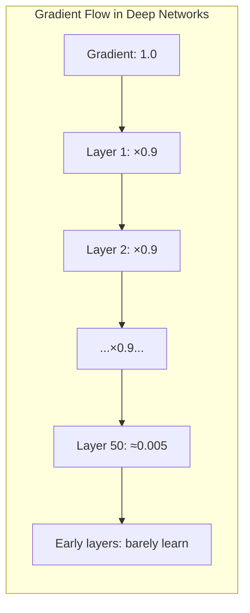
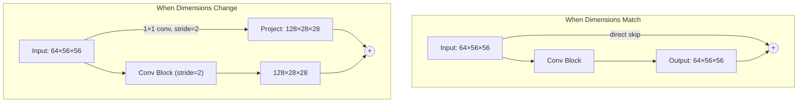
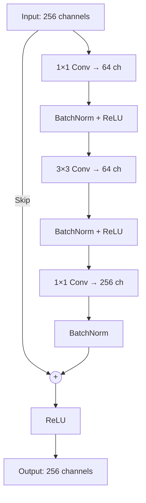
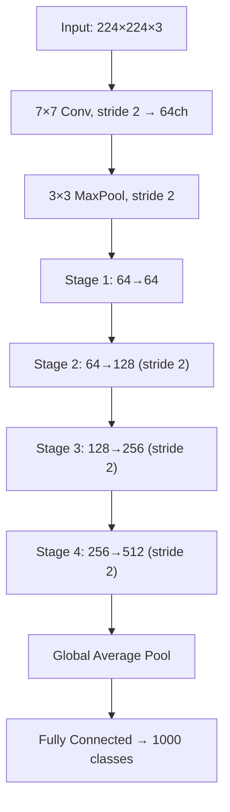

# ResNet: Understanding Residual Networks

ResNet (2015) solved one of deep learning's most frustrating problems: why do deeper networks sometimes perform *worse* than shallow ones? The answer changed computer vision forever.

> **The Key Insight**: Instead of learning a direct mapping, let each layer learn the *difference* (residual) from its input. This creates "information highways" that gradients can flow through freely.

---

## The Problem: Vanishing Gradients

Imagine you're playing telephone with 100 people. By the time a message reaches the end, it's completely distorted. Deep neural networks have the same problem:



With each layer, gradients get multiplied by small numbers. After 50+ layers, the gradient reaching early layers is essentially zero—they stop learning.

---

## The Solution: Skip Connections

ResNet's brilliant idea: let information "skip" over layers through a shortcut connection.


### The Math

Instead of learning $H(x)$ directly, we learn $F(x) = H(x) - x$:

$$y = F(x) + x$$

**Why does this help?**

1. **Easy baseline**: If the optimal function is identity ($H(x) = x$), the network just needs $F(x) = 0$
2. **Gradient highway**: During backprop, gradient flows through the $+x$ unchanged
3. **Additive, not multiplicative**: Gradients add rather than multiply

---

## 1. The Basic Block (ResNet-18/34)

Used in smaller ResNets. Two 3×3 convolutions with a skip connection:

```python
from flax import nnx
import jax.numpy as jnp
from typing import Optional

class BasicBlock(nnx.Module):
    """The building block for ResNet-18 and ResNet-34."""
    expansion = 1  # Output channels = input channels
    
    def __init__(self, in_channels: int, out_channels: int, stride: int = 1,
                 downsample: Optional[nnx.Module] = None, *, rngs: nnx.Rngs):
        # Main path: two 3×3 convolutions
        self.conv1 = nnx.Conv(in_channels, out_channels, kernel_size=(3, 3),
                              strides=stride, padding=1, use_bias=False, rngs=rngs)
        self.bn1 = nnx.BatchNorm(out_channels, rngs=rngs)
        
        self.conv2 = nnx.Conv(out_channels, out_channels, kernel_size=(3, 3),
                              strides=1, padding=1, use_bias=False, rngs=rngs)
        self.bn2 = nnx.BatchNorm(out_channels, rngs=rngs)
        
        # Skip connection might need to match dimensions
        self.downsample = downsample

    def __call__(self, x, training: bool = True):
        identity = x
        
        # Main path: Conv -> BN -> ReLU -> Conv -> BN
        out = nnx.relu(self.bn1(self.conv1(x), use_running_average=not training))
        out = self.bn2(self.conv2(out), use_running_average=not training)
        
        # Match dimensions if needed (when stride > 1 or channels change)
        if self.downsample is not None:
            identity = self.downsample(x, training=training)
        
        # The magic: add skip connection, then ReLU
        return nnx.relu(out + identity)
```

### What's `downsample`?

When the feature map size or channel count changes, the skip connection can't directly add—dimensions don't match. We use a 1×1 convolution to project:



---

## 2. The Bottleneck Block (ResNet-50/101/152)

For deeper networks, a 3-layer "bottleneck" design is more efficient:

1. **1×1 conv**: Reduce channels (compress)
2. **3×3 conv**: Learn spatial features (expensive operation on fewer channels)
3. **1×1 conv**: Expand channels back (decompress)



**Why bottleneck?** 
- 3×3 conv on 256 channels = 256 × 256 × 9 = 590k parameters
- 1×1→64, 3×3→64, 1×1→256 = 16k + 37k + 16k = 69k parameters

Same receptive field, 8× fewer parameters!

```python
class Bottleneck(nnx.Module):
    """The bottleneck block for ResNet-50, 101, and 152."""
    expansion = 4  # Output channels = 4× input channels
    
    def __init__(self, in_channels: int, out_channels: int, stride: int = 1,
                 downsample: Optional[nnx.Module] = None, *, rngs: nnx.Rngs):
        # 1×1 compress
        self.conv1 = nnx.Conv(in_channels, out_channels, kernel_size=(1, 1),
                              use_bias=False, rngs=rngs)
        self.bn1 = nnx.BatchNorm(out_channels, rngs=rngs)
        
        # 3×3 spatial features
        self.conv2 = nnx.Conv(out_channels, out_channels, kernel_size=(3, 3),
                              strides=stride, padding=1, use_bias=False, rngs=rngs)
        self.bn2 = nnx.BatchNorm(out_channels, rngs=rngs)
        
        # 1×1 expand (note: × self.expansion)
        self.conv3 = nnx.Conv(out_channels, out_channels * self.expansion,
                              kernel_size=(1, 1), use_bias=False, rngs=rngs)
        self.bn3 = nnx.BatchNorm(out_channels * self.expansion, rngs=rngs)
        
        self.downsample = downsample

    def __call__(self, x, training: bool = True):
        identity = x
        
        out = nnx.relu(self.bn1(self.conv1(x), use_running_average=not training))
        out = nnx.relu(self.bn2(self.conv2(out), use_running_average=not training))
        out = self.bn3(self.conv3(out), use_running_average=not training)
        
        if self.downsample is not None:
            identity = self.downsample(x, training=training)
        
        return nnx.relu(out + identity)
```

---

## 3. Model Variants

ResNet comes in different sizes. The architecture stays the same—only the number of blocks changes:

| Model | Block Type | Layers per Stage | Total Layers | Params |
|-------|-----------|------------------|--------------|--------|
| ResNet-18 | Basic | [2, 2, 2, 2] | 18 | 11M |
| ResNet-34 | Basic | [3, 4, 6, 3] | 34 | 21M |
| ResNet-50 | Bottleneck | [3, 4, 6, 3] | 50 | 25M |
| ResNet-101 | Bottleneck | [3, 4, 23, 3] | 101 | 44M |
| ResNet-152 | Bottleneck | [3, 8, 36, 3] | 152 | 60M |

---

## 4. The Full Architecture



```python
class ResNet(nnx.Module):
    """Full ResNet model."""
    
    def __init__(self, block_cls, layers: list, num_classes: int = 1000, *, rngs: nnx.Rngs):
        self.in_channels = 64
        
        # Stem: 7×7 conv + maxpool
        self.conv1 = nnx.Conv(3, 64, kernel_size=(7, 7), strides=2, 
                              padding=3, use_bias=False, rngs=rngs)
        self.bn1 = nnx.BatchNorm(64, rngs=rngs)
        
        # Four stages with increasing channels
        self.layer1 = self._make_layer(block_cls, 64, layers[0], stride=1, rngs=rngs)
        self.layer2 = self._make_layer(block_cls, 128, layers[1], stride=2, rngs=rngs)
        self.layer3 = self._make_layer(block_cls, 256, layers[2], stride=2, rngs=rngs)
        self.layer4 = self._make_layer(block_cls, 512, layers[3], stride=2, rngs=rngs)
        
        # Classification head
        self.fc = nnx.Linear(512 * block_cls.expansion, num_classes, rngs=rngs)

    def _make_layer(self, block_cls, out_channels, num_blocks, stride, rngs):
        # First block might downsample
        downsample = None
        if stride != 1 or self.in_channels != out_channels * block_cls.expansion:
            downsample = DownsampleBlock(self.in_channels, 
                                         out_channels * block_cls.expansion, stride, rngs)
        
        layers = [block_cls(self.in_channels, out_channels, stride, downsample, rngs=rngs)]
        self.in_channels = out_channels * block_cls.expansion
        
        # Remaining blocks have stride=1
        for _ in range(1, num_blocks):
            layers.append(block_cls(self.in_channels, out_channels, rngs=rngs))
        
        return layers

    def __call__(self, x, training: bool = True):
        # Stem
        x = nnx.relu(self.bn1(self.conv1(x), use_running_average=not training))
        x = nnx.max_pool(x, window_shape=(3, 3), strides=(2, 2), padding=((1, 1), (1, 1)))
        
        # Four stages
        for stage in [self.layer1, self.layer2, self.layer3, self.layer4]:
            for block in stage:
                x = block(x, training=training)
        
        # Global average pool and classify
        x = jnp.mean(x, axis=(1, 2))  # [B, C]
        return self.fc(x)

# Helper for skip connection projection
class DownsampleBlock(nnx.Module):
    def __init__(self, in_ch, out_ch, stride, rngs):
        self.conv = nnx.Conv(in_ch, out_ch, (1, 1), strides=stride, use_bias=False, rngs=rngs)
        self.bn = nnx.BatchNorm(out_ch, rngs=rngs)
    
    def __call__(self, x, training=True):
        return self.bn(self.conv(x), use_running_average=not training)
```

### Creating Different Variants

```python
def resnet18(num_classes=1000, rngs=None):
    return ResNet(BasicBlock, [2, 2, 2, 2], num_classes, rngs=rngs)

def resnet50(num_classes=1000, rngs=None):
    return ResNet(Bottleneck, [3, 4, 6, 3], num_classes, rngs=rngs)

def resnet101(num_classes=1000, rngs=None):
    return ResNet(Bottleneck, [3, 4, 23, 3], num_classes, rngs=rngs)
```

---

## 5. Training

```python
import optax
from jax.sharding import Mesh, NamedSharding, PartitionSpec as P

# Distributed training setup
devices = jax.devices()
mesh = Mesh(np.array(devices), ('batch',))
data_sharding = NamedSharding(mesh, P('batch', None, None, None))

@nnx.jit
def train_step(model, optimizer, images, labels):
    def loss_fn(model):
        logits = model(images, training=True)
        loss = optax.softmax_cross_entropy_with_integer_labels(logits, labels).mean()
        acc = jnp.mean(jnp.argmax(logits, axis=1) == labels)
        return loss, acc
    
    (loss, acc), grads = nnx.value_and_grad(loss_fn, has_aux=True)(model)
    optimizer.update(grads)
    return loss, acc
```

---

## Limitations & What Came Next

| Limitation | Why It Matters | Modern Solution |
|------------|---------------|-----------------|
| **Local receptive field** | Each 3×3 conv only sees neighbors | Vision Transformers (ViT) |
| **Fixed resolution** | Trained at 224×224 specifically | Multi-scale training, ViT |
| **Channel-heavy** | Many parameters in later layers | EfficientNet (balanced scaling) |
| **Depth limitation** | Even skip connections struggle at 1000+ layers | NFNet (no BatchNorm) |

> **The Takeaway**: ResNet proved that simple architectural changes (skip connections) can beat raw depth. Modern networks like EfficientNet and ConvNeXt build on these principles while addressing ResNet's limitations.
