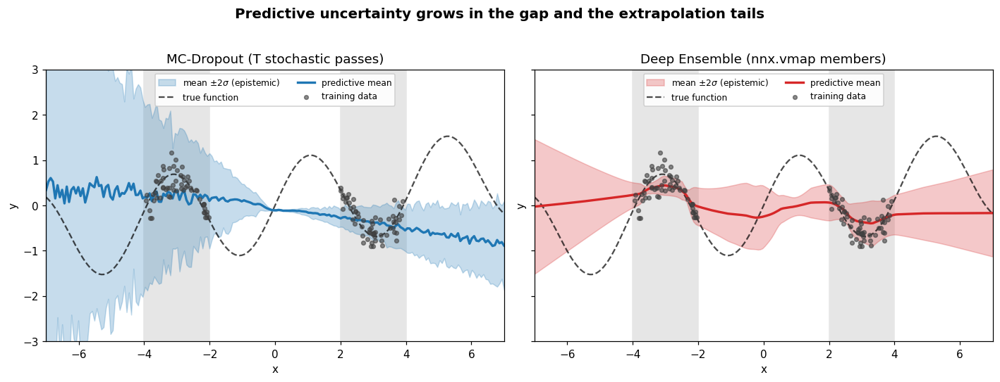

# Uncertainty Estimation

**A prediction without a confidence is only half an answer.** This guide builds two practical uncertainty estimators in Flax NNX — Monte-Carlo Dropout and deep ensembles — and decomposes their predictions into *aleatoric* (data noise) and *epistemic* (model ignorance) parts on a 1D heteroscedastic regression task.

:::note Prerequisites
A research-grade guide. You should be comfortable with [training best practices](/basics/training-best-practices) (dropout, optimizers, NLL losses). It pairs naturally with [adversarial training](/research/adversarial-training): both ask what a model does when the input drifts away from its training distribution.
:::

:::tip What you'll learn
- Why a point prediction is not enough, and how to split predictive variance into **aleatoric + epistemic** parts
- **MC-Dropout**: keep dropout ON at test time and run `T` stochastic forward passes to approximate a Bayesian posterior
- **Deep ensembles**: train `M` networks at once with `nnx.vmap` and aggregate their disagreement
- How to train a Gaussian mean+variance head with the **heteroscedastic NLL** loss
- Why uncertainty *grows* in gaps between clusters and in the extrapolation tails
:::

:::info Example Code
See the full implementation: [`examples/advanced/uncertainty.py`](https://github.com/mlnomadpy/flaxdocs/tree/master/examples/advanced/uncertainty.py)
:::

## Why Uncertainty?

A standard regressor outputs a single number $\hat y = f_\theta(x)$. But two very different situations produce the same point estimate:

- The input is noisy but *familiar* — the model has seen lots of nearby data (irreducible **aleatoric** noise).
- The input is far from anything in the training set — the model is *guessing* (**epistemic** uncertainty).

Distinguishing these is essential for active learning, out-of-distribution detection, safe control, and Bayesian optimization. The trick is to make the model produce a **distribution** over outputs, then measure its spread.

## The Predictive Variance Decomposition

Let each network define a Gaussian per input, $p(y \mid x, \theta) = \mathcal{N}\big(\mu_\theta(x),\, \sigma_\theta^2(x)\big)$, where the variance head $\sigma_\theta^2(x)$ captures input-dependent (heteroscedastic) noise. Averaging over an approximate posterior $\theta \sim q(\theta)$ — realized as $T$ dropout masks or $M$ ensemble members — the **law of total variance** splits the predictive variance cleanly:

$$
\underbrace{\operatorname{Var}(y \mid x)}_{\text{total}}
= \underbrace{\mathbb{E}_{\theta}\!\left[\sigma_\theta^2(x)\right]}_{\text{aleatoric}}
+ \underbrace{\operatorname{Var}_{\theta}\!\left(\mu_\theta(x)\right)}_{\text{epistemic}}
$$

With $K$ samples $\{(\mu_k, \sigma_k^2)\}_{k=1}^{K}$ (either $K=T$ MC passes or $K=M$ members), the Monte-Carlo estimates are:

$$
\bar\mu(x) = \frac{1}{K}\sum_{k} \mu_k(x),\qquad
\underbrace{\frac{1}{K}\sum_{k} \sigma_k^2(x)}_{\text{aleatoric}},\qquad
\underbrace{\frac{1}{K}\sum_{k} \big(\mu_k(x) - \bar\mu(x)\big)^2}_{\text{epistemic}}
$$

The key intuition: **aleatoric** noise is what the variance heads report on average, while **epistemic** uncertainty is how much the *means* disagree. Where data is dense, the means agree and epistemic uncertainty collapses; in gaps and tails, they fan out.

## The Model: a Gaussian MLP with Dropout

The network predicts a mean and a log-variance. Dropout layers double as the source of MC stochasticity. We clamp `log_var` for numerical stability.

```python
from flax import nnx
import jax.numpy as jnp

class GaussianMLP(nnx.Module):
    """MLP that outputs (mu, log_var) with dropout for MC sampling."""

    def __init__(self, in_features=1, hidden=64, dropout_rate=0.1, *, rngs: nnx.Rngs):
        self.l1 = nnx.Linear(in_features, hidden, rngs=rngs)
        self.l2 = nnx.Linear(hidden, hidden, rngs=rngs)
        self.drop = nnx.Dropout(dropout_rate, rngs=rngs)
        self.mu_head = nnx.Linear(hidden, 1, rngs=rngs)
        self.logvar_head = nnx.Linear(hidden, 1, rngs=rngs)

    def __call__(self, x, train: bool = False):
        h = nnx.relu(self.l1(x))
        h = self.drop(h, deterministic=not train)
        h = nnx.relu(self.l2(h))
        h = self.drop(h, deterministic=not train)
        mu = self.mu_head(h)
        log_var = jnp.clip(self.logvar_head(h), -6.0, 4.0)
        return mu, log_var
```

### Heteroscedastic NLL loss

Training the variance head with the Gaussian negative log-likelihood lets the model learn *where* the data is noisy, instead of assuming one global $\sigma$:

$$
\mathcal{L}(\theta) = \frac{1}{N}\sum_{i} \frac{1}{2}\left[\log \sigma_\theta^2(x_i) + \frac{(y_i - \mu_\theta(x_i))^2}{\sigma_\theta^2(x_i)}\right]
$$

```python
def gaussian_nll(mu, log_var, y):
    """Mean Gaussian negative log-likelihood (drops the constant term)."""
    inv_var = jnp.exp(-log_var)
    return 0.5 * jnp.mean(log_var + (y - mu) ** 2 * inv_var)
```

### Train step

A standard NNX train step — `nnx.value_and_grad` with `has_aux=True`, then `optimizer.update(model, grads)`:

```python
@nnx.jit
def train_step(model, optimizer, batch):
    def loss_fn(model):
        mu, log_var = model(batch["x"], train=True)
        loss = gaussian_nll(mu, log_var, batch["y"])
        return loss, mu

    (loss, mu), grads = nnx.value_and_grad(loss_fn, has_aux=True)(model)
    optimizer.update(model, grads)
    return loss, mu
```

## Method 1: MC-Dropout

Gal & Ghahramani showed that a network trained with dropout, *left on at test time*, approximates a deep Gaussian process posterior. Concretely: keep `train=True` at inference and run `T` forward passes. Each call advances the dropout RNG, so the `T` predictions differ — their spread is the epistemic signal.

```python
@nnx.jit
def _mc_forward(model, x):
    return model(x, train=True)  # dropout stays ACTIVE

def mc_predict(model, x, n_samples=30):
    mus, variances = [], []
    for _ in range(n_samples):
        mu, log_var = _mc_forward(model, x)
        mus.append(mu)
        variances.append(jnp.exp(log_var))
    mus = jnp.stack(mus)            # (T, N, 1)
    variances = jnp.stack(variances)
    return {
        "mean":      mus.mean(axis=0),
        "aleatoric": variances.mean(axis=0),   # E[sigma^2]
        "epistemic": mus.var(axis=0),          # Var(mu)
        "total":     variances.mean(axis=0) + mus.var(axis=0),
    }
```

## Method 2: Deep Ensembles via `nnx.vmap`

Deep ensembles (Lakshminarayanan et al.) are embarrassingly simple and often *better calibrated* than fancier Bayesian methods: train `M` networks from different random inits and aggregate. In JAX we don't loop — we `vmap`. A single vmapped constructor builds all `M` members **and** their optimizers, and one vmapped step trains them together.

```python
import optax

@nnx.vmap(in_axes=0, out_axes=0)
def make_ensemble(key):
    """Build one independently-initialized member + its optimizer per key."""
    model = GaussianMLP(dropout_rate=0.1, rngs=nnx.Rngs(key))
    optimizer = nnx.Optimizer(model, optax.adam(1e-2), wrt=nnx.Param)
    return model, optimizer

@nnx.vmap(in_axes=(0, 0, 0), out_axes=0)
def ensemble_train_step(model, optimizer, batch):
    def loss_fn(model):
        mu, log_var = model(batch["x"], train=True)
        return gaussian_nll(mu, log_var, batch["y"])
    loss, grads = nnx.value_and_grad(loss_fn)(model)
    optimizer.update(model, grads)
    return loss
```

Each member is trained on its own **bootstrap resample** of the data (`in_axes=0` over a batch of shape `(M, N, 1)`), which adds diversity on top of the random inits. Aggregation reuses the same decomposition — only the averaging axis is now the model axis:

```python
@nnx.vmap(in_axes=(0, None), out_axes=0)
def _ensemble_forward(model, x):
    return model(x, train=False)   # deterministic; diversity comes from params

def ensemble_predict(models, x):
    mu, log_var = _ensemble_forward(models, x)   # each (M, N, 1)
    variances = jnp.exp(log_var)
    return {
        "mean":      mu.mean(axis=0),
        "aleatoric": variances.mean(axis=0),
        "epistemic": mu.var(axis=0),
        "total":     variances.mean(axis=0) + mu.var(axis=0),
    }
```

Building the ensemble and its optimizers with `make_ensemble(jax.random.split(key, M))` returns pytrees with a leading `M` axis; `_ensemble_forward` maps over that axis (broadcasting the shared inputs with `in_axes=(0, None)`) to produce `(M, N, 1)` predictions.

## Results / What to Expect

Running the example (small CPU defaults: 120 training points in two clusters, a single MC-Dropout net for 500 steps, and a 5-member ensemble for 1000 steps) takes well under a minute:

```console
$ python advanced/uncertainty.py
======================================================================
UNCERTAINTY ESTIMATION: MC-Dropout + Deep Ensembles
======================================================================
Training points: 120 (two clusters, heteroscedastic noise)

[1/2] Training a single MC-Dropout network...
  step  100/500 | NLL 2.0752
  step  200/500 | NLL 2.0067
  step  300/500 | NLL 2.0034
  step  400/500 | NLL 2.0042
  step  500/500 | NLL 2.0025
  MC-Dropout epistemic: in-cluster 0.27764 | away 0.72647

[2/2] Training a deep ensemble of 5 networks (nnx.vmap)...
  step  200/1000 | mean NLL 0.2462
  step  400/1000 | mean NLL -0.1143
  step  600/1000 | mean NLL -0.1560
  step  800/1000 | mean NLL -0.2839
  step 1000/1000 | mean NLL -0.3380
  Ensemble epistemic:   in-cluster 0.02592 | away 0.12889

======================================================================
Uncertainty grows away from the training data for BOTH methods.
Aleatoric captures data noise; epistemic captures model ignorance.
======================================================================
```

The headline numbers are the `in-cluster` vs `away` **epistemic** uncertainty. For both methods, epistemic uncertainty is markedly larger away from the training clusters (in the middle gap and the extrapolation tails) than inside them — exactly the behavior we want. The ensemble's negative NLL means it fits the data likelihood tightly, while its epistemic variance still fans out where there is no data.

The script also saves the figure that makes this concrete — the iconic uncertainty band:



*Each panel shows the training scatter (grey), the true function (dashed), the predictive mean (solid), and a shaded ±2σ **epistemic** band. The band collapses to near-zero width over the two shaded training clusters and balloons in the central gap and the extrapolation tails — the model "knows what it doesn't know," which is exactly the behavior that makes uncertainty estimates trustworthy.*

## Common Pitfalls

- ❌ Calling the model with `train=False` for MC-Dropout — dropout is disabled, every pass is identical, epistemic variance collapses to zero.
  ✅ Use `train=True` at inference (`_mc_forward` above) so masks are resampled each pass.

- ❌ Averaging over the wrong axis. Stacking `T` passes gives shape `(T, N, 1)`; taking `.var()` over everything mixes samples and data points.
  ✅ Reduce over `axis=0` only: `mus.var(axis=0)` for epistemic, `variances.mean(axis=0)` for aleatoric.

- ❌ Reporting `Var(mu)` as the *total* uncertainty. That drops the aleatoric term and under-estimates noise in high-noise regions.
  ✅ Report `total = aleatoric + epistemic`, and keep the two components separate when you need to act on them.

- ❌ Giving the vmapped constructor a defaulted scalar arg (e.g. `def make_ensemble(key, dropout_rate=0.1)`). `nnx.vmap(in_axes=0)` then tries to map a rank-0 value and crashes.
  ✅ Keep only the mapped argument (`key`) in the signature; bake constants inside the function body.

- ❌ Letting `log_var` run to `±∞`, producing `NaN` losses when `exp(-log_var)` overflows.
  ✅ Clamp it (`jnp.clip(log_var, -6.0, 4.0)`) and train with the numerically stable NLL that uses `exp(-log_var)` rather than dividing by a variance.

## Next steps

- [Interpretability](/research/interpretability) — pair uncertainty maps with saliency to understand *why* a model is unsure.
- [Advanced Techniques](/research/advanced-techniques) — more research-grade training patterns in Flax NNX.
- [Adversarial Training](/research/adversarial-training) — the flip side: what a model does when inputs are pushed off-distribution on purpose.

## Complete Example

The full, runnable script — data generation, both methods, and the region-wise uncertainty report — lives at [`examples/advanced/uncertainty.py`](https://github.com/mlnomadpy/flaxdocs/tree/master/examples/advanced/uncertainty.py). Run it with `EPOCHS`, `BATCH`, `N_MODELS`, and `MC_SAMPLES` environment variables to scale it up.

## References

- [Dropout as a Bayesian Approximation: Representing Model Uncertainty in Deep Learning](https://arxiv.org/abs/1506.02142) (Gal & Ghahramani, 2015) — the MC-Dropout foundation.
- [What Uncertainties Do We Need in Bayesian Deep Learning for Computer Vision?](https://arxiv.org/abs/1703.04977) (Kendall & Gal, 2017) — the aleatoric/epistemic decomposition used here.
- [Simple and Scalable Predictive Uncertainty Estimation using Deep Ensembles](https://arxiv.org/abs/1612.01474) (Lakshminarayanan et al., 2016) — deep ensembles with Gaussian mean+variance heads.
